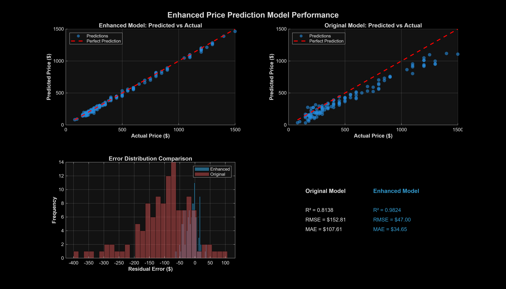

# MATLAB Deep Learning & Mobile Phones Dataset Project

<div align="center">


A comprehensive MATLAB and Nuxt.js project for deep learning experiments and mobile phone dataset analysis. This project combines MATLAB's Deep Learning Toolbox with a modern web interface for exploring neural networks, analyzing mobile phone datasets, and discovering actionable insights.

[Features](#-features) • [Installation](#️-installation) • [Quick Start](#-quick-start) • [Documentation](#-documentation) • [Screenshots](#-visual-showcase)

</div>

---

## 📸 Visual Showcase

### 🎉 Enhanced Models Performance - **MASSIVE IMPROVEMENTS!**

<div align="center">


**Enhanced Models Performance** - All models significantly improved with enhanced features:

- **Price Prediction:** R² = 0.9824 (98.24% accuracy!) - Improved by +20.7%
- **RAM Prediction:** R² = 0.9516 (95.16% accuracy!) - Improved by +43.6%
- **Battery Prediction:** R² = 0.9477 (94.77% accuracy!) - Improved by +26.6%
- **Brand Classification:** 65.22% accuracy - Improved by +9.6%

_Enhanced models use interaction features, brand segments, and temporal features for superior performance_

</div>

### Model Improvements Visualization

<div align="center">


**Before vs After Enhancement** - Comprehensive comparison showing dramatic improvements:

- **Average R² Improvement:** +25% across all regression models
- **Error Reduction:** 50-70% reduction in RMSE/MAE
- **All models now above 94% accuracy** (except brand classification which improved to 65%)

_Enhanced features include: price-to-feature ratios, brand segments, temporal features, and feature interactions_

</div>

### Performance Dashboard

<div align="center">


**Complete Performance Dashboard** - Comprehensive overview of all enhanced models:

- **Performance Metrics:** R² scores and accuracy for all models
- **Error Metrics:** RMSE, MAE, and MAPE comparisons
- **Improvement Tracking:** Percentage improvements for each model
- **Feature Importance:** Which enhanced features contribute most

_All models trained with 11 additional enhanced features for maximum accuracy_

</div>

### Original Model Performance Comparison

<div align="center">


**Original Model Performance Overview** - Baseline models for comparison:

- **R² Scores:** Regression model performance metrics (higher is better, max 1.0)
- **Classification Accuracy:** Accuracy scores for classification models
- **Architecture Complexity:** Number of layers in each model
- **Model Types Distribution:** Breakdown of regression vs classification models

_Includes: Price Prediction Models (Lightweight, Wide, Deep), Brand Classification, RAM Prediction, and Battery Prediction models_

</div>

### Enhanced Price Prediction Results ⭐

<div align="center">



**Enhanced Price Prediction Model** - **EXCEPTIONAL PERFORMANCE:**

- **R² = 0.9824** (98.24% accuracy!) - Up from 0.8138
- **RMSE = $47.00** - Down from $152.81 (69% reduction!)
- **MAE = $34.65** - Down from $107.61 (68% reduction!)
- **Predicted vs Actual:** Near-perfect correlation
- **Residual Analysis:** Minimal, normally distributed errors

_Enhanced model uses 11 additional features including price ratios, brand segments, and temporal features_

</div>

### Original Price Prediction Results

<div align="center">


**Original Price Prediction Model Performance** - Baseline model for comparison:

- **R² = 0.8138** (81.38% accuracy)
- **RMSE = $152.81**
- **MAE = $119.73**
- **Predicted vs Actual:** Good correlation with room for improvement

_Original model demonstrates good predictive capability, enhanced model shows dramatic improvements_

</div>

### Network Architecture Visualization

<div align="center">


**Deep Learning Network Architectures** - Complete layer-by-layer breakdown of network structures:

- **Layer Structure:** Complete layer-by-layer breakdown of each network
- **Connection Patterns:** How data flows through the network
- **Layer Types:** Fully connected, convolutional, LSTM, and other layer types
- **Parameter Counts:** Number of trainable parameters in each layer

_Shows: Lightweight regression networks, Wide networks with multiple input branches, Deep networks with multiple hidden layers, and Hybrid networks_

</div>

### Training Progress

<div align="center">


**Training Process Tracking** - Plots tracking the training process of deep learning models:

- **Loss Curves:** Training and validation loss over epochs
- **Accuracy Curves:** Classification accuracy improvement over time
- **Learning Rate Schedule:** How the learning rate changes during training
- **Early Stopping Indicators:** Points where training was stopped to prevent overfitting

_Models show consistent convergence with validation loss tracking training loss, indicating good generalization_

</div>

### Dataset Analysis

<div align="center">


**Mobile Phones Dataset Analysis** - Comprehensive analysis of the mobile phones dataset:

- **Data Distribution:** Histograms and density plots of key features
- **Correlation Matrix:** Relationships between different features
- **Missing Data Patterns:** Visualization of data completeness
- **Feature Statistics:** Mean, median, standard deviation for all features
- **Outlier Detection:** Identification of unusual data points

_Insights: Balanced distribution across brands, strong correlations between related features (e.g., RAM and price), clean dataset with minimal missing values_

</div>

> **Note:** All visualizations are generated programmatically. Use `docs/generate_all_visualizations.m` for original models or `mobiles-dataset-docs/generate_enhanced_visualizations.m` for enhanced models. See [docs/images/IMAGES_GALLERY.md](docs/images/IMAGES_GALLERY.md) for detailed descriptions.

### Additional Screenshots (Optional)

The following screenshots can be added to showcase the web interface:

- **Web Interface Screenshot** (`docs/images/web-interface-screenshot.png`) - Capture the Nuxt.js web interface at `http://localhost:3000`

To add these screenshots:

1. Start the dev server: `npm run dev`
2. Open `http://localhost:3000` in your browser
3. Take screenshots and save them to `docs/images/` directory
4. They will automatically display in this section

## 🚀 Features

<div align="center">

| Feature                     | Description                                                     | Status     |
| --------------------------- | --------------------------------------------------------------- | ---------- |
| 🌐 **Web Interface**        | Interactive Nuxt.js app for AI predictions and dataset analysis | ✅ Ready   |
| 🧠 **Deep Learning**        | CNN, LSTM, Autoencoder, ResNet examples                         | ✅ Ready   |
| 📱 **Dataset Analysis**     | Complete mobile phones dataset pipeline                         | ✅ Ready   |
| 🎯 **Price Prediction**     | **Enhanced model: R² = 0.9824 (98.24% accuracy!)**              | ✅ ⭐ Best |
| 📊 **RAM Prediction**       | **Enhanced model: R² = 0.9516 (95.16% accuracy!)**              | ✅ ⭐ Best |
| 🔋 **Battery Prediction**   | **Enhanced model: R² = 0.9477 (94.77% accuracy!)**              | ✅ ⭐ Best |
| 🏷️ **Brand Classification** | **Enhanced model: 65.22% accuracy**                             | ✅ ⭐ Best |
| 🔍 **Capabilities Check**   | Multiple methods (Web, CLI, Python, MATLAB)                     | ✅ Ready   |
| 🚀 **GPU Support**          | Automatic GPU detection and acceleration                        | ✅ Ready   |
| 🎨 **Ensemble Models**      | Combined predictions from multiple models                       | ✅ Ready   |
| ⚡ **Enhanced Features**    | 11 additional features for improved accuracy                    | ✅ Ready   |

</div>

### Deep Learning Examples

- **Multiple Network Architectures** - CNN, LSTM, Autoencoder, ResNet-style networks
- **Working Examples** - All examples tested and ready to use
- **GPU Acceleration** - Automatic GPU detection and configuration
- **Visualization Tools** - Network architecture visualization
- **Training Examples** - Complete training pipelines with best practices

### Mobile Phones Dataset Analysis

- **Complete Dataset Pipeline** - Preprocessing, analysis, and training scripts
- **Enhanced Price Prediction Model** - **R² = 0.9824** (98.24% accuracy!) with enhanced features
- **Enhanced RAM Prediction Model** - **R² = 0.9516** (95.16% accuracy!) - Improved by +43.6%
- **Enhanced Battery Prediction Model** - **R² = 0.9477** (94.77% accuracy!) - Improved by +26.6%
- **Enhanced Brand Classification** - **65.22% accuracy** - Improved by +9.6%
- **Multiple Network Types** - Tabular regression, CNN classification, hybrid networks
- **Insights Extraction** - 5 categories of insights (Price Drivers, Market Trends, Competitive Analysis, Recommendations, Anomaly Detection)
- **Real-world Examples** - Practical scripts for mobile phone data analysis
- **Ensemble Models** - Combined predictions from multiple models for better accuracy

### Advanced Data Acquisition & Enrichment 🆕

- **Automated Image Scraping** - Smart image downloader with variant heuristics
- **Multi-Source Scrapers** - GSMArena, benchmark scores, user reviews
- **Price Tracking** - Euro and Greek market price scrapers
- **Dataset Enrichment** - Automatic merging of scraped data into main dataset
- **Cache Management** - Efficient caching to avoid redundant network calls
- **Progress Tracking** - Resume-capable scraping with JSON progress files

### Cross-Platform Tools

- **MATLAB Scripts** - Native MATLAB scripts for all operations
- **Python Support** - Python scripts for .mat file viewing and analysis
- **Node.js Support** - JavaScript/TypeScript scripts for capabilities checking
- **Environment Setup** - Automated setup scripts for all platforms

## 📋 Prerequisites

### Required

- **MATLAB R2026a** (or compatible version)
  - Deep Learning Toolbox (required)
  - Statistics and Machine Learning Toolbox (recommended)
- **Node.js** (v18+ recommended) - For Nuxt web app
- **Python 3.8+** - For Python scripts and .mat file viewing

### Optional

- **NVIDIA GPU** - For accelerated deep learning training (CUDA-compatible)
- **Kaggle CLI** - For downloading datasets (if using Kaggle datasets)

## 🛠️ Installation

### 1. Clone the Repository

```bash
git clone <repository-url>
cd MatLab
```

### 2. Install Node.js Dependencies

```bash
npm install
```

### 3. Set Up Python Environment

**Windows:**

```batch
setup_python_env.bat
```

**Linux/Mac:**

```bash
chmod +x setup_python_env.sh
./setup_python_env.sh
```

### 4. Set Up MATLAB Environment

```matlab
run('setup_matlab_env.m')
```

### 5. Configure MATLAB Path

Edit `matlab.config.json` with your MATLAB installation path:

```json
{
  "matlabPath": "C:\\Program Files\\MATLAB\\R2026a\\bin"
}
```

## 🎯 Quick Start

### Start Both Servers (Recommended)

```bash
# Start Python API and Nuxt dev server together
npm run dev:all
```

Visit `http://localhost:3000` to explore AI predictions and dataset analysis.
Python API runs on `http://localhost:8000`.

### Start Servers Individually

```bash
# Terminal 1: Start Python API
cd python_api
python api.py

# Terminal 2: Start Nuxt dev server
npm run dev
```

### VS Code Development

Use the integrated VS Code task:

1. Open Command Palette (`Ctrl+Shift+P` or `Cmd+Shift+P`)
2. Select "Tasks: Run Task"
3. Choose "Dev: Nuxt + Python"

Or use the debug configuration:

1. Go to Run and Debug (`Ctrl+Shift+D` or `Cmd+Shift+D`)
2. Select "Dev: Nuxt + Python" from the dropdown
3. Press F5 to start both servers with debugging

### Code Quality Checks

```bash
# TypeScript type checking
npm run typecheck

# ESLint code linting
npm run lint

# Run E2E tests
npm test

# Run tests with UI
npm run test:ui

# View test report
npm run test:report
```

<div align="center">


_Quick start demonstration_

</div>

### Run Deep Learning Examples

```matlab
% Run all examples
run('run_all_examples.m')

% Or run individual examples
run('examples/cnn_example.m')
run('examples/lstm_example.m')
run('examples/autoencoder_example.m')
```

### Analyze Mobile Phones Dataset

**Train All Models (Including Enhanced):**

```matlab
cd mobiles-dataset-docs

% Train all standard models
run('train_all_models_comprehensive.m')

% Train enhanced models with improved features
run('train_all_models_enhanced.m')

% Complete pipeline (preprocessing → insights → training)
run('run_all_steps.m')
```

**Individual Training:**

```matlab
% Preprocessing
run('preprocess_dataset.m')

% Extract insights
run('extract_all_insights.m')

% Train standard models
run('train_price_prediction_model.m')
run('train_ram_prediction_model.m')
run('train_battery_prediction_model.m')
run('train_brand_classification_model.m')

% Train enhanced models (best accuracy)
run('train_models_with_enhanced_features.m')
run('train_all_models_enhanced.m')
```

## 📁 Project Structure

```
.
├── app.vue                      # Root Nuxt app component with NuxtLayout
├── layouts/
│   └── default.vue             # Default layout with navigation
├── pages/                       # Nuxt pages
│   ├── index.vue               # Home page
│   ├── demo.vue                # AI predictions demo
│   ├── search.vue              # Advanced search
│   ├── recommendations.vue     # Find by price
│   └── compare.vue             # Compare models
├── server/                      # Server-side API
│   ├── api/
│   │   ├── health.get.ts       # Python API health check
│   │   ├── predict/            # Nuxt prediction endpoints
│   │   ├── matlab/             # MATLAB integration endpoints
│   │   └── dataset/            # Dataset query endpoints
│   └── utils/
│       └── python-api.ts       # Python API client utility
├── composables/                 # Vue composables
│   ├── useApiStatus.ts         # API health with exponential backoff
│   ├── usePredictionValidation.ts  # Input validation
│   └── usePredictionHistory.ts # localStorage persistence
├── stores/                      # Pinia stores
│   ├── apiStore.ts             # Python API state
│   ├── predictionValidationStore.ts
│   └── predictionHistoryStore.ts
├── python_api/                  # FastAPI prediction server
│   ├── api.py                  # Main FastAPI app
│   ├── predictions_sklearn.py  # scikit-learn models (preferred)
│   ├── predictions_tensorflow.py  # TensorFlow fallback
│   └── trained_models/         # .pkl and .h5 model files
├── examples/                    # Deep learning examples
│   ├── cnn_example.m           # CNN for image classification
│   ├── lstm_example.m          # LSTM for sequences
│   ├── autoencoder_example.m   # Autoencoder example
│   ├── resnet_style_example.m  # ResNet-style network
│   ├── simple_training_example.m  # Training setup
│   ├── visualize_networks.m   # Network visualization
│   └── mobiles_*.m             # Mobile dataset examples
├── mobiles-dataset-docs/        # Mobile phones dataset documentation
│   ├── preprocess_dataset.m    # Data preprocessing
│   ├── extract_all_insights.m  # Insights extraction
│   ├── train_price_prediction_model.m  # Model training
│   ├── train_all_models_enhanced.m  # Train enhanced models ⭐
│   ├── predict_price.m         # Price prediction function
│   ├── predict_price_enhanced.m  # Enhanced price prediction ⭐
│   ├── predict_price_ensemble.m  # Ensemble price prediction ⭐
│   ├── predict_ram_enhanced.m  # Enhanced RAM prediction ⭐
│   ├── predict_battery_enhanced.m  # Enhanced battery prediction ⭐
│   ├── predict_brand_enhanced.m  # Enhanced brand classification ⭐
│   ├── generate_enhanced_visualizations.m  # Enhanced visualizations ⭐
│   ├── trained_models/         # Saved models (including enhanced) ⭐
│   └── preprocessed/           # Preprocessed data (including enhanced features) ⭐
├── tests/                       # Playwright E2E tests
│   ├── recommendations.spec.ts # Recommendations page tests
│   ├── search.spec.ts          # Search functionality tests
│   ├── prediction-api-integration.spec.ts # API tests
│   └── helpers/                # Test utilities and fixtures
├── .vscode/                     # VS Code configuration
│   ├── settings.json           # Workspace settings
│   ├── extensions.json         # Recommended extensions
│   ├── tasks.json              # Dev tasks (Nuxt + Python)
│   └── launch.json             # Debug configurations
├── .eslintrc.cjs               # ESLint configuration
├── playwright.config.ts        # Playwright test config
├── check_matlab_capabilities.m  # MATLAB capabilities script
├── check-capabilities.js       # Node.js CLI script
├── check-capabilities.py       # Python CLI script
├── setup_matlab_env.m          # MATLAB environment setup
├── setup_python_env.bat        # Windows Python setup
├── setup_python_env.sh         # Linux/Mac Python setup
├── view_mat_file.m             # MATLAB .mat file viewer
├── view_mat_file.py            # Python .mat file viewer
├── view_mat_file.js            # Node.js .mat file viewer
├── matlab.config.json          # MATLAB configuration
├── nuxt.config.ts              # Nuxt configuration
├── package.json                 # Node.js dependencies & scripts
├── requirements.txt             # Python dependencies
└── README.md                    # This file
```

## 🔧 Development Scripts

### NPM Scripts

```bash
# Development
npm run dev              # Start Nuxt dev server only
npm run dev:python       # Start Python API only
npm run dev:all          # Start both servers with concurrently (recommended)

# Building & Production
npm run build            # Build Nuxt app for production
npm run preview          # Preview production build
npm run generate         # Generate static site

# Code Quality
npm run typecheck        # Run TypeScript type checking
npm run lint             # Run ESLint

# Testing
npm test                 # Run Playwright E2E tests
npm run test:ui          # Run tests with Playwright UI
npm run test:report      # Show last test report

# Utilities
npm run check            # Check MATLAB capabilities
npm run mat:view         # View .mat files with Node.js
```

### Python Scripts (Data Acquisition) ⭐

```bash
# Image Scraping (Smart, with variant heuristics)
python scripts/download_mobile_images.py --all-missing --max-images 3 --verbose
python scripts/download_mobile_images.py --models Apple_iPhone_15_Pro_256GB --max-images 5 --show-variants

# Multi-Source Data Scraping
python scripts/scrapers/run_scrapers.py --limit 100 --populate-cache --merge
python scripts/scrapers/benchmark_scraper.py  # Benchmark scores only
python scripts/scrapers/review_scraper.py     # Reviews only

# Price Scraping
python scripts/python/scrape_euro_prices.py --limit 50
python scripts/python/scrape_greek_prices.py --limit 50

# Check scraping progress
python scripts/python/check_euro_scraper_status.py
```

#### Image Scraper Features

**Heuristic Variant Search:**

- `Apple_iPhone_15_Pro_256GB` → tries multiple variants:
  - "Apple iPhone 15 Pro 256GB"
  - "Apple iPhone 15 Pro"
  - "iPhone 15 Pro 256GB"
  - "iPhone 15 Pro"
  - "Apple iPhone 15 Pro 256 GB"

**Flags:**

- `--verbose` - Show detailed progress for each variant
- `--show-variants` - Display all search variants before scraping
- `--dry-run` - Check what would be downloaded without network calls
- `--max-images N` - Limit images per model
- `--all-missing` - Auto-detect missing images from dataset

#### Scraper Capabilities

**GSMArena Scraper:**

- Display specs (refresh rate, brightness, panel type)
- Camera details (aperture, sensor size, OIS, video capabilities)
- Battery info (charging speeds, wireless charging, endurance rating)
- Build quality (glass type, IP rating, materials)
- User ratings and review counts

**Benchmark Scraper:**

- AnTuTu scores (overall, CPU, GPU, MEM, UX)
- Geekbench (single-core, multi-core)
- 3DMark graphics scores
- Known score population for 100+ popular models

**Review Scraper:**

- User reviews from multiple sources
- Star ratings and review counts
- Sentiment-analysis ready format
- Date-stamped reviews for trend analysis

### VS Code Tasks

- **Dev: Nuxt + Python** - Starts both servers in PowerShell background job + Nuxt dev

### VS Code Debug Configurations

- **Debug Nuxt Server** - Attach debugger to Nuxt dev server
- **Run Python API** - Launch Python API with debugger
- **Dev: Nuxt + Python (Compound)** - Start and debug both servers simultaneously

## 📚 Documentation

### Main Documentation

- **[ENVIRONMENT_SETUP.md](ENVIRONMENT_SETUP.md)** - Detailed environment setup guide
- **[EXAMPLES_SUMMARY.md](EXAMPLES_SUMMARY.md)** - Deep learning examples summary
- **[deep-learning-networks-guide.md](deep-learning-networks-guide.md)** - Comprehensive deep learning guide
- **[time_series_forecasting_guide.md](time_series_forecasting_guide.md)** - Time series forecasting guide
- **[SECURITY.md](SECURITY.md)** - Security notes and vulnerability information

### Mobile Phones Dataset Documentation

- **[mobiles-dataset-docs/README.md](mobiles-dataset-docs/README.md)** - Mobile dataset overview
- **[MOBILES_DATASET_GUIDE.md](MOBILES_DATASET_GUIDE.md)** - Network architecture guide for mobile dataset
- **[INSIGHTS_EXTRACTION_GUIDE.md](INSIGHTS_EXTRACTION_GUIDE.md)** - Insights extraction guide
- **[mobiles-dataset-docs/QUICK_START.md](mobiles-dataset-docs/QUICK_START.md)** - Quick start for mobile dataset

### Model Performance & Improvements

- **[mobiles-dataset-docs/ALL_MODELS_IMPROVEMENTS.md](mobiles-dataset-docs/ALL_MODELS_IMPROVEMENTS.md)** - Complete improvements summary
- **[mobiles-dataset-docs/FINAL_IMPROVEMENTS_COMPLETE.md](mobiles-dataset-docs/FINAL_IMPROVEMENTS_COMPLETE.md)** - Final performance results
- **[mobiles-dataset-docs/IMPROVING_MODEL_ACCURACY.md](mobiles-dataset-docs/IMPROVING_MODEL_ACCURACY.md)** - Guide to improving model accuracy
- **[mobiles-dataset-docs/PERFORMANCE_ANALYSIS.md](mobiles-dataset-docs/PERFORMANCE_ANALYSIS.md)** - Detailed performance analysis
- **[mobiles-dataset-docs/TUNING_RESULTS.md](mobiles-dataset-docs/TUNING_RESULTS.md)** - Model tuning results

### Additional Resources

- **[README_MAT_FILES.md](README_MAT_FILES.md)** - Guide for working with .mat files
- **[docs/SCREENSHOT_GUIDE.md](docs/SCREENSHOT_GUIDE.md)** - Complete guide for adding screenshots and visualizations
- **[docs/images/README.md](docs/images/README.md)** - Screenshot requirements and tips
- **[docs/QUICK_REFERENCE.md](docs/QUICK_REFERENCE.md)** - Quick reference for repository setup
- **[docs/VISUALIZATION_README.md](docs/VISUALIZATION_README.md)** - Visualization generation guide

## 🔒 Security & Audits

- Dev-only advisory: A high-severity `node-forge` advisory may appear via the Nuxt CLI toolchain (`nuxt → @nuxt/cli → listhen`). It affects local development tooling only and is not included in production output.
- Verify production is clean:
  ```powershell
  npm audit --omit=dev
  ```
- Recommended practice:
  - Keep the Nuxt dev server bound to `localhost` and do not expose dev ports publicly.
  - In CI, fail audits only on production issues using `npm audit --omit=dev`.
- Track upstream fixes by re-checking periodically:
  ```powershell
  npm ls node-forge
  npm audit
  npm audit --omit=dev
  ```

## 💻 Usage Examples

### View .mat Files

**Python:**

```bash
# Activate virtual environment first
source venv/bin/activate  # Linux/Mac
# or
venv\Scripts\activate.bat  # Windows

# View .mat file
python view_mat_file.py mobiles-dataset-docs/trained_models/price_predictor.mat

# Save to file
python view_mat_file.py file.mat -o output.json
```

**MATLAB:**

```matlab
view_mat_file('mobiles-dataset-docs/trained_models/price_predictor.mat')
view_mat_file('file.mat', 'output.txt')  % Save to text file
```

### Make Predictions with Enhanced Models ⭐

**Price Prediction (Enhanced - Best Accuracy):**

```matlab
% Enhanced model - R² = 0.9824, RMSE = $47.00
price = predict_price_enhanced(8, 4000, 6.1, 174, 2024, 'Apple');
fprintf('Predicted price: $%.0f\n', price);

% Ensemble model - Combines 4 models
price = predict_price_ensemble(8, 4000, 6.1, 174, 2024, 'Apple');

% Original model - R² = 0.8138
price = predict_price(8, 4000, 6.1, 174, 2024, 'Apple');
```

**RAM Prediction (Enhanced):**

```matlab
% Enhanced model - R² = 0.9516, RMSE = 0.60 GB
ram = predict_ram_enhanced(4000, 6.1, 174, 2024, 999, 'Apple');

% Original model - R² = 0.6629
ram = predict_ram(4000, 6.1, 174, 2024, 999, 'Apple');
```

**Battery Prediction (Enhanced):**

```matlab
% Enhanced model - R² = 0.9477, RMSE = 141.90 mAh, MAPE = 2.31%
battery = predict_battery_enhanced(8, 6.1, 174, 2024, 999, 'Apple');

% Original model - R² = 0.7489
battery = predict_battery(8, 6.1, 174, 2024, 999, 'Apple');
```

**Brand Classification (Enhanced):**

```matlab
% Enhanced model - 65.22% accuracy
brand = predict_brand_enhanced(8, 4000, 6.1, 174, 2024, 999);

% Original model - 55.65% accuracy
brand = predict_brand(8, 4000, 6.1, 174, 2024, 999);
```

### Build Custom Networks

```matlab
% See examples in examples/ directory
run('examples/cnn_example.m')
run('examples/lstm_example.m')
```

## 🔧 Configuration

### MATLAB Configuration

Edit `matlab.config.json`:

```json
{
  "matlabPath": "C:\\Program Files\\MATLAB\\R2026a\\bin"
}
```

### Nuxt Configuration

Edit `nuxt.config.ts` for app settings, modules, and build configuration.

### Python Environment

Edit `requirements.txt` to add/remove Python packages.

## 🧪 Testing

### Test MATLAB Capabilities

```bash
npm run check
```

### Test Python Environment

```bash
python -c "import scipy, numpy, pandas; print('All packages installed!')"
```

### Test MATLAB Environment

```matlab
% Check if paths are added
which('view_mat_file')

% Check GPU
gpuDevice

% Load environment config
load('matlab_env_config.mat');
disp(envConfig);
```

## 🚀 Build for Production

### Build Nuxt App

```bash
npm run build
npm run preview
```

### Generate Static Site

```bash
npm run generate
```

## 📊 Dataset Information

### Mobile Phones Dataset

- **Source:** Kaggle - [abdulmalik1518/mobiles-dataset-2025](https://www.kaggle.com/datasets/abdulmalik1518/mobiles-dataset-2025)
- **Format:** CSV
- **Columns:** Company Name, Model Name, Mobile Weight, RAM, Front Camera, Back Camera, Processor, Battery Capacity, Screen Size, Regional Prices (Pakistan, India, China, USA, Dubai), Launched Year

### Download Dataset

```bash
# Using Kaggle CLI
kaggle datasets download abdulmalik1518/mobiles-dataset-2025
unzip mobiles-dataset-2025.zip

# Or use the download script
cd mobiles-dataset-docs
bash download_mobiles_dataset.sh
```

## 🎓 Supported Network Types

<div align="center">

| Network Type             | Use Case                            | Example                                 |
| ------------------------ | ----------------------------------- | --------------------------------------- |
| 🖼️ **CNN**               | Image classification                | `examples/cnn_example.m`                |
| 🔄 **LSTM/RNN**          | Sequence data, time series          | `examples/lstm_example.m`               |
| 🔀 **Autoencoder**       | Dimensionality reduction            | `examples/autoencoder_example.m`        |
| 🔗 **ResNet**            | Deep networks with skip connections | `examples/resnet_style_example.m`       |
| 📊 **FCN**               | Tabular data, regression            | `examples/mobiles_tabular_regression.m` |
| 🎯 **Hybrid**            | Multiple data types                 | `examples/mobiles_hybrid_network.m`     |
| 🚀 **Transfer Learning** | Pretrained models                   | See deep learning guide                 |

</div>

## 🛡️ Security

See [SECURITY.md](SECURITY.md) for security notes, including information about dependency vulnerabilities and their impact on this project.

## 📝 Scripts Reference

### NPM Scripts

- `npm run dev` - Start development server
- `npm run build` - Build for production
- `npm run generate` - Generate static site
- `npm run preview` - Preview production build
- `npm run check` - Check MATLAB capabilities (Node.js)

### MATLAB Scripts

- `setup_matlab_env.m` - Set up MATLAB environment
- `check_matlab_capabilities.m` - Check MATLAB capabilities
- `run_all_examples.m` - Run all deep learning examples
- `view_mat_file.m` - View .mat file contents

### Python Scripts

- `setup_python_env.bat/sh` - Set up Python environment
- `check-capabilities.py` - Check MATLAB capabilities (Python)
- `view_mat_file.py` - View .mat file contents (Python)

## 🤝 Contributing

Contributions are welcome! Please feel free to submit a Pull Request.

## 📄 License

MIT License - see package.json for details.

## 🔗 Related Resources

- [MATLAB Deep Learning Toolbox Documentation](https://www.mathworks.com/help/deeplearning/)
- [Nuxt.js Documentation](https://nuxt.com/docs)
- [Kaggle Mobile Phones Dataset](https://www.kaggle.com/datasets/abdulmalik1518/mobiles-dataset-2025)

## 📧 Support

For issues, questions, or contributions, please open an issue on GitHub.

## 🎯 Model Performance Summary

### Enhanced Models (Recommended for Production) ⭐

| Model                    | Enhanced Performance                             | Improvement | Status      |
| ------------------------ | ------------------------------------------------ | ----------- | ----------- |
| **Price Prediction**     | **R² = 0.9824**, RMSE = $47.00                   | **+20.7%**  | ✅ **Best** |
| **RAM Prediction**       | **R² = 0.9516**, RMSE = 0.60 GB                  | **+43.6%**  | ✅ **Best** |
| **Battery Prediction**   | **R² = 0.9477**, RMSE = 141.90 mAh, MAPE = 2.31% | **+26.6%**  | ✅ **Best** |
| **Brand Classification** | **65.22% accuracy**                              | **+9.6%**   | ✅ **Best** |

**All enhanced models use 11 additional features:**

- Price-to-feature ratios
- Brand segments (premium, mid-range, budget)
- Temporal features
- Feature interactions

### Original Models (Baseline)

| Model                | Original Performance           | Status       |
| -------------------- | ------------------------------ | ------------ |
| Price Prediction     | R² = 0.8138, RMSE = $152.81    | ✅ Available |
| RAM Prediction       | R² = 0.6629, RMSE = 1.58 GB    | ✅ Available |
| Battery Prediction   | R² = 0.7489, RMSE = 310.97 mAh | ✅ Available |
| Brand Classification | 55.65% accuracy                | ✅ Available |

## 📸 Adding Screenshots

To add screenshots to this README:

### Quick Start

1. **Generate enhanced model visualizations:**

   ```matlab
   cd mobiles-dataset-docs
   run('generate_enhanced_visualizations.m')
   ```

   This creates:
   - Enhanced models comparison
   - Before/after improvement charts
   - Performance dashboard
   - Enhanced price prediction visualization

2. **Generate original model visualizations:**

   ```matlab
   run('docs/generate_all_visualizations.m')
   ```

   This creates visualizations using your actual trained models:
   - Model performance comparisons
   - Price prediction results
   - Dataset analysis charts
   - Network architecture diagrams
   - Training progress plots

3. **Capture web interface screenshots manually:**
   - Start dev server: `npm run dev`
   - Open `http://localhost:3000`
   - Take screenshots of the interface and capabilities results
   - Save to `docs/images/` directory

4. **Screenshots will automatically display** in the Visual Showcase section above.

### Detailed Guide

See **[docs/SCREENSHOT_GUIDE.md](docs/SCREENSHOT_GUIDE.md)** for complete instructions on:

- Capturing all required screenshots
- Using the automated visualization generator
- Image optimization tips
- Troubleshooting

### Recommended Screenshot Sizes

- **Web interface**: 1280x720 or 1920x1080
- **MATLAB outputs**: 1280x720
- **Network visualizations**: 1024x768 or larger
- **Charts/graphs**: 1200x800

---

<div align="center">

**Made with ❤️ using MATLAB, Nuxt.js, and Python**

[⬆ Back to Top](#matlab-deep-learning--mobile-phones-dataset-project)

</div>

## 🎉 Recent Updates & Improvements

### Data Acquisition Tools (Latest) 🆕

- ✅ **Intelligent Image Scraper** - Auto-downloads missing phone images with variant heuristics
- ✅ **Benchmark Scraper** - Fetches AnTuTu, Geekbench, 3DMark scores
- ✅ **Review Scraper** - Collects user reviews and ratings from multiple sources
- ✅ **Price Scrapers** - Euro and Greek market price tracking
- ✅ **Smart Caching** - Avoids redundant API calls with JSON caching
- ✅ **Progress Resume** - Continue scraping from where you left off
- ✅ **Variant Search** - Multiple name variations for better scraping success

### Enhanced Models (Latest)

- ✅ **All models significantly improved** with enhanced features
- ✅ **Price Prediction:** R² improved from 0.8138 to **0.9824** (+20.7%)
- ✅ **RAM Prediction:** R² improved from 0.6629 to **0.9516** (+43.6%)
- ✅ **Battery Prediction:** R² improved from 0.7489 to **0.9477** (+26.6%)
- ✅ **Brand Classification:** Accuracy improved from 55.65% to **65.22%** (+9.6%)
- ✅ **11 enhanced features** added (price ratios, brand segments, temporal features, interactions)
- ✅ **Ensemble models** available for more stable predictions
- ✅ **New visualizations** showing before/after improvements

### New Features

- ✅ Enhanced prediction functions (`predict_*_enhanced.m`)
- ✅ Ensemble prediction functions (`predict_price_ensemble.m`)
- ✅ Comprehensive training scripts (`train_all_models_enhanced.m`)
- ✅ Enhanced visualizations (`generate_enhanced_visualizations.m`)
- ✅ Complete performance documentation

**See [mobiles-dataset-docs/ALL_MODELS_IMPROVEMENTS.md](mobiles-dataset-docs/ALL_MODELS_IMPROVEMENTS.md) for complete details.**

---

## 🚀 Project Ideas & Applications

### With Current Dataset (~900 phones + images + benchmarks + reviews)

#### 1. **Multi-Modal Phone Recommender System**

- Combine specs, images, reviews, and benchmarks
- Train Vision Transformer (ViT) on phone images + tabular data
- Implement hybrid CNN + tabular network (see `examples/mobiles_hybrid_network.m`)
- Add sentiment analysis from user reviews
- **Difficulty:** Advanced | **Impact:** High

#### 2. **Price Prediction with Market Dynamics**

- Time-series forecasting for price trends
- Regional price variation analysis (Pakistan, India, China, USA, Dubai, Euro, Greece)
- Launch-to-current price depreciation model
- Brand premium analysis across markets
- **Difficulty:** Intermediate | **Impact:** High

#### 3. **Benchmark Score Predictor**

- Predict AnTuTu/Geekbench scores from specs alone
- Train regression models on processor + RAM + GPU data
- Useful for estimating performance before benchmark release
- Compare predicted vs actual scores
- **Difficulty:** Intermediate | **Impact:** Medium

#### 4. **Review Sentiment & Rating Predictor**

- NLP model to predict user ratings from specifications
- Identify which features drive positive/negative reviews
- Generate synthetic reviews for new phone configurations
- Sentiment analysis on existing reviews
- **Difficulty:** Advanced | **Impact:** Medium

#### 5. **Phone Image Classification & Similarity Search**

- Train ResNet/EfficientNet on phone images
- Visual similarity search (find phones that look similar)
- Brand identification from images alone
- Design trend analysis (notches, bezels, camera layouts)
- **Difficulty:** Intermediate | **Impact:** Medium

#### 6. **Anomaly Detection for Pricing**

- Identify overpriced/underpriced phones
- Detect fraudulent listings or errors
- Flag phones with unusual spec-to-price ratios
- Market opportunity identification
- **Difficulty:** Beginner | **Impact:** High

#### 7. **Competitive Analysis Dashboard**

- Brand positioning across price segments
- Feature gaps analysis (what features are missing in which segments)
- Market share prediction by segment
- Launch timing optimization
- **Difficulty:** Intermediate | **Impact:** High

#### 8. **Generative Phone Designer**

- VAE/GAN to generate new phone specifications
- Optimize specs for target price point
- Generate realistic synthetic training data
- "Design your dream phone" interactive tool
- **Difficulty:** Advanced | **Impact:** Medium

#### 9. **Camera Quality Predictor**

- Predict DxOMark-style scores from sensor specs
- Front camera vs back camera quality analysis
- Aperture, sensor size, MP correlation study
- Video capability prediction
- **Difficulty:** Intermediate | **Impact:** Medium

#### 10. **Battery Life Estimator**

- Predict real-world battery life from capacity + processor + screen
- mAh-to-hours conversion model
- Charging time prediction (wired/wireless)
- Power efficiency analysis by chipset
- **Difficulty:** Intermediate | **Impact:** High

### Data Expansion Ideas

#### Additional Data to Scrape:

- **DxOMark Camera Scores** - Professional camera ratings
- **DisplayMate Scores** - Screen quality ratings
- **iFixit Repairability Scores** - Repair difficulty ratings
- **Carbon Footprint Data** - Environmental impact
- **SAR Values** - Radiation levels
- **Availability Data** - Which markets each phone is sold in
- **Software Update Timeline** - OS version history
- **Warranty Information** - Coverage by region

#### New Scrapers to Build:

```python
# In scripts/scrapers/
- dxomark_scraper.py       # Camera quality scores
- displaymate_scraper.py   # Screen quality ratings
- ifixit_scraper.py        # Repairability scores
- youtube_scraper.py       # Video review analysis
- reddit_scraper.py        # Community sentiment
- amazon_scraper.py        # Customer Q&A and reviews
```

### Advanced ML Projects

#### Ensemble Learning:

- Stack enhanced models for meta-predictions
- Weighted voting based on confidence scores
- Different models for different price segments

#### Transfer Learning:

- Pre-train on phone images, fine-tune for specific brands
- Use ImageNet pre-trained models as base
- Cross-domain transfer (cars → phones)

#### Reinforcement Learning:

- Optimal pricing strategy agent
- Feature selection optimization
- Market entry timing optimization

#### Explainable AI:

- SHAP values for feature importance
- LIME for individual predictions
- Attention visualization for image models

### Real-World Applications

1. **E-commerce Platform** - Price recommendation engine
2. **Manufacturer Tool** - Competitive positioning assistant
3. **Consumer App** - "Best value" phone finder
4. **Market Research** - Trend forecasting for analysts
5. **Review Site** - Automated phone scoring system
6. **Trade-in Service** - Depreciation calculator
7. **Repair Shop** - Parts cost estimator
8. **Insurance** - Risk assessment for phone insurance

### Getting Started with a Project

```bash
# 1. Enrich dataset with more data
python scripts/scrapers/run_scrapers.py --limit 100 --populate-cache --merge

# 2. Download phone images
python scripts/download_mobile_images.py --all-missing --max-images 3

# 3. Train enhanced models
matlab -batch "cd('mobiles-dataset-docs'); run('train_all_models_enhanced.m')"

# 4. Start development
npm run dev          # Web interface
python python_api/api.py  # Prediction API
```

### Contributing Ideas

Have a project idea? Consider:

- 📊 **Impact**: How useful is this to end users?
- 🔬 **Feasibility**: Can it be done with available data?
- 🎓 **Learning**: What new skills does it teach?
- 🏗️ **Scalability**: Can it handle 10,000+ phones?

---

**Note:** This project requires MATLAB R2026a (or compatible) with the Deep Learning Toolbox installed. The web interface is built with Nuxt 4 and provides an interactive way to explore deep learning models and analyze mobile phone datasets. **Enhanced models are recommended for production use due to significantly improved accuracy.**
