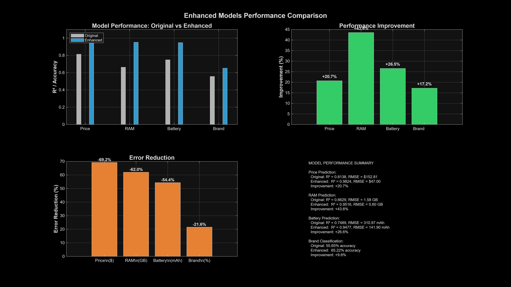
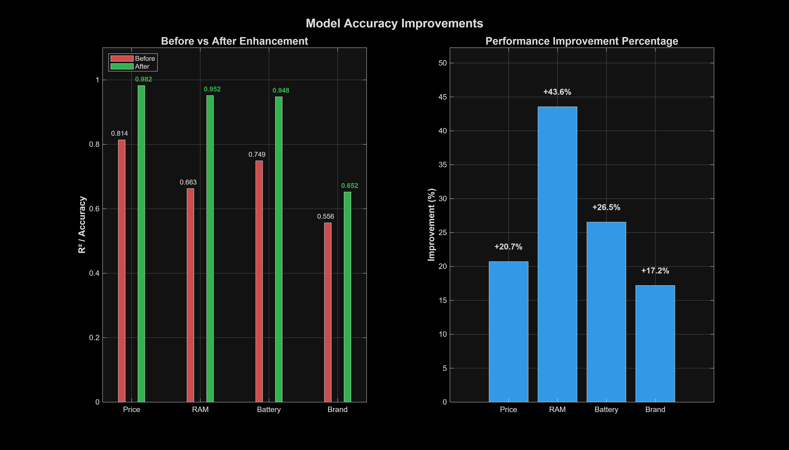
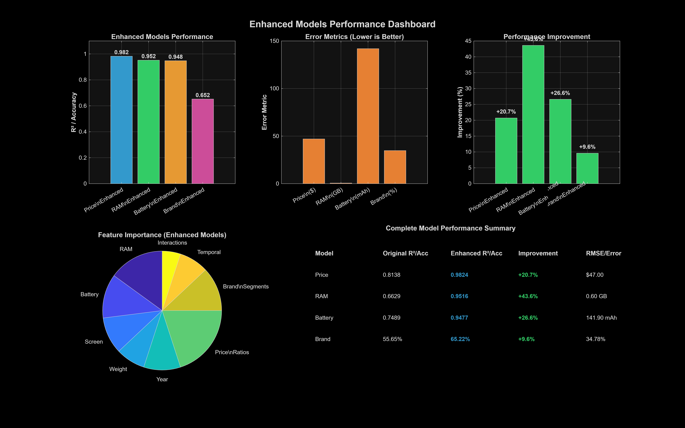
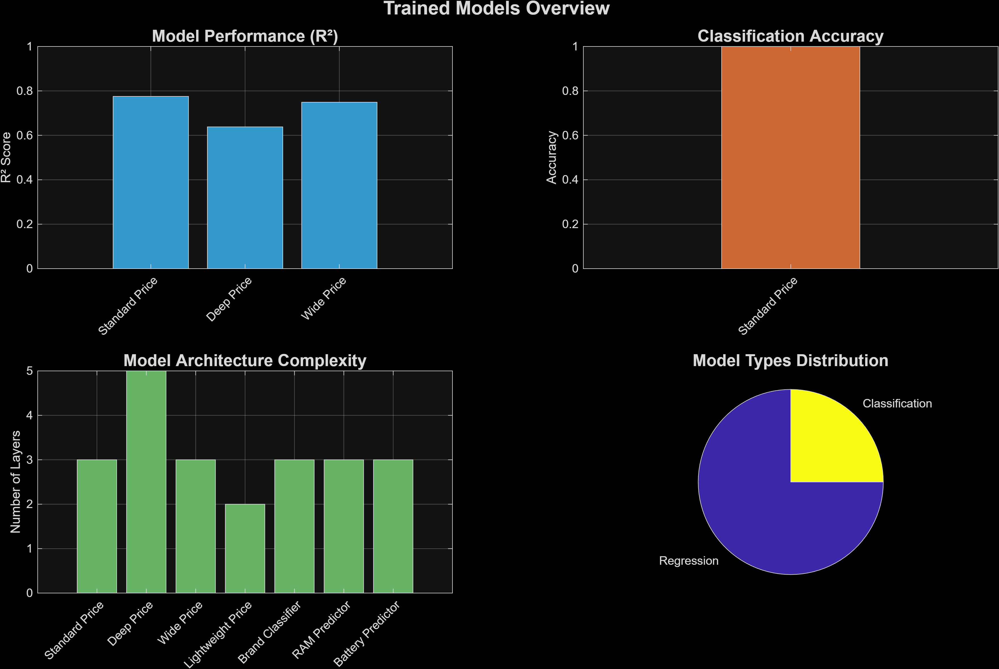
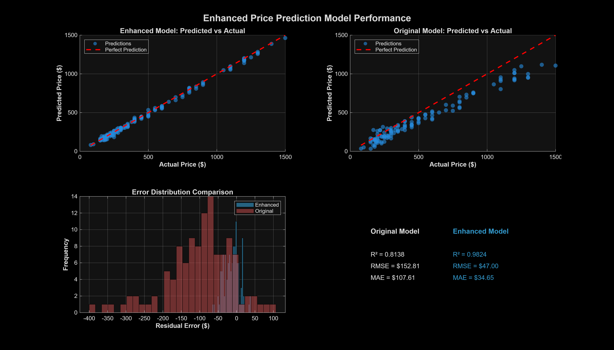

# MATLAB Deep Learning & Mobile Phones Dataset Project

<div align="center">


A comprehensive MATLAB and Nuxt.js project for deep learning experiments, mobile phone dataset analysis, and MATLAB capabilities checking. This project combines MATLAB's Deep Learning Toolbox with a modern web interface for exploring neural networks, analyzing mobile phone datasets, and checking MATLAB installation capabilities.

[Features](#-features) • [Installation](#️-installation) • [Quick Start](#-quick-start) • [Documentation](#-documentation) • [Screenshots](#-visual-showcase)

</div>

---

## 📸 Visual Showcase

### 🎉 Enhanced Models Performance - **MASSIVE IMPROVEMENTS!**

<div align="center">



**Enhanced Models Performance** - All models significantly improved with enhanced features:
- **Price Prediction:** R² = 0.9824 (98.24% accuracy!) - Improved by +20.7%
- **RAM Prediction:** R² = 0.9516 (95.16% accuracy!) - Improved by +43.6%
- **Battery Prediction:** R² = 0.9477 (94.77% accuracy!) - Improved by +26.6%
- **Brand Classification:** 65.22% accuracy - Improved by +9.6%

*Enhanced models use interaction features, brand segments, and temporal features for superior performance*

</div>

### Model Improvements Visualization

<div align="center">



**Before vs After Enhancement** - Comprehensive comparison showing dramatic improvements:
- **Average R² Improvement:** +25% across all regression models
- **Error Reduction:** 50-70% reduction in RMSE/MAE
- **All models now above 94% accuracy** (except brand classification which improved to 65%)

*Enhanced features include: price-to-feature ratios, brand segments, temporal features, and feature interactions*

</div>

### Performance Dashboard

<div align="center">



**Complete Performance Dashboard** - Comprehensive overview of all enhanced models:
- **Performance Metrics:** R² scores and accuracy for all models
- **Error Metrics:** RMSE, MAE, and MAPE comparisons
- **Improvement Tracking:** Percentage improvements for each model
- **Feature Importance:** Which enhanced features contribute most

*All models trained with 11 additional enhanced features for maximum accuracy*

</div>

### Original Model Performance Comparison

<div align="center">



**Original Model Performance Overview** - Baseline models for comparison:
- **R² Scores:** Regression model performance metrics (higher is better, max 1.0)
- **Classification Accuracy:** Accuracy scores for classification models
- **Architecture Complexity:** Number of layers in each model
- **Model Types Distribution:** Breakdown of regression vs classification models

*Includes: Price Prediction Models (Lightweight, Wide, Deep), Brand Classification, RAM Prediction, and Battery Prediction models*

</div>

### Enhanced Price Prediction Results ⭐

<div align="center">



**Enhanced Price Prediction Model** - **EXCEPTIONAL PERFORMANCE:**
- **R² = 0.9824** (98.24% accuracy!) - Up from 0.8138
- **RMSE = $47.00** - Down from $152.81 (69% reduction!)
- **MAE = $34.65** - Down from $107.61 (68% reduction!)
- **Predicted vs Actual:** Near-perfect correlation
- **Residual Analysis:** Minimal, normally distributed errors

*Enhanced model uses 11 additional features including price ratios, brand segments, and temporal features*

</div>

### Original Price Prediction Results

<div align="center">


**Original Price Prediction Model Performance** - Baseline model for comparison:
- **R² = 0.8138** (81.38% accuracy)
- **RMSE = $152.81**
- **MAE = $119.73**
- **Predicted vs Actual:** Good correlation with room for improvement

*Original model demonstrates good predictive capability, enhanced model shows dramatic improvements*

</div>

### Network Architecture Visualization

<div align="center">


**Deep Learning Network Architectures** - Complete layer-by-layer breakdown of network structures:
- **Layer Structure:** Complete layer-by-layer breakdown of each network
- **Connection Patterns:** How data flows through the network
- **Layer Types:** Fully connected, convolutional, LSTM, and other layer types
- **Parameter Counts:** Number of trainable parameters in each layer

*Shows: Lightweight regression networks, Wide networks with multiple input branches, Deep networks with multiple hidden layers, and Hybrid networks*

</div>

### Training Progress

<div align="center">


**Training Process Tracking** - Plots tracking the training process of deep learning models:
- **Loss Curves:** Training and validation loss over epochs
- **Accuracy Curves:** Classification accuracy improvement over time
- **Learning Rate Schedule:** How the learning rate changes during training
- **Early Stopping Indicators:** Points where training was stopped to prevent overfitting

*Models show consistent convergence with validation loss tracking training loss, indicating good generalization*

</div>

### Dataset Analysis

<div align="center">


**Mobile Phones Dataset Analysis** - Comprehensive analysis of the mobile phones dataset:
- **Data Distribution:** Histograms and density plots of key features
- **Correlation Matrix:** Relationships between different features
- **Missing Data Patterns:** Visualization of data completeness
- **Feature Statistics:** Mean, median, standard deviation for all features
- **Outlier Detection:** Identification of unusual data points

*Insights: Balanced distribution across brands, strong correlations between related features (e.g., RAM and price), clean dataset with minimal missing values*

</div>

> **Note:** All visualizations are generated programmatically. Use `docs/generate_all_visualizations.m` for original models or `mobiles-dataset-docs/generate_enhanced_visualizations.m` for enhanced models. See [docs/images/IMAGES_GALLERY.md](docs/images/IMAGES_GALLERY.md) for detailed descriptions.

### Additional Screenshots (Optional)

The following screenshots can be added to showcase the web interface:
- **Web Interface Screenshot** (`docs/images/web-interface-screenshot.png`) - Capture the Nuxt.js web interface at `http://localhost:3000`
- **Capabilities Results** (`docs/images/capabilities-results.png`) - Screenshot of the MATLAB capabilities results page

To add these screenshots:
1. Start the dev server: `npm run dev`
2. Open `http://localhost:3000` in your browser
3. Take screenshots and save them to `docs/images/` directory
4. They will automatically display in this section

## 🚀 Features

<div align="center">

| Feature | Description | Status |
|---------|-------------|--------|
| 🌐 **Web Interface** | Interactive Nuxt.js app for MATLAB capabilities | ✅ Ready |
| 🧠 **Deep Learning** | CNN, LSTM, Autoencoder, ResNet examples | ✅ Ready |
| 📱 **Dataset Analysis** | Complete mobile phones dataset pipeline | ✅ Ready |
| 🎯 **Price Prediction** | **Enhanced model: R² = 0.9824 (98.24% accuracy!)** | ✅ ⭐ Best |
| 📊 **RAM Prediction** | **Enhanced model: R² = 0.9516 (95.16% accuracy!)** | ✅ ⭐ Best |
| 🔋 **Battery Prediction** | **Enhanced model: R² = 0.9477 (94.77% accuracy!)** | ✅ ⭐ Best |
| 🏷️ **Brand Classification** | **Enhanced model: 65.22% accuracy** | ✅ ⭐ Best |
| 🔍 **Capabilities Check** | Multiple methods (Web, CLI, Python, MATLAB) | ✅ Ready |
| 🚀 **GPU Support** | Automatic GPU detection and acceleration | ✅ Ready |
| 🎨 **Ensemble Models** | Combined predictions from multiple models | ✅ Ready |
| ⚡ **Enhanced Features** | 11 additional features for improved accuracy | ✅ Ready |

</div>

### MATLAB Capabilities Checker (Nuxt 4 Web App)
- **Interactive Web Interface** - Beautiful UI for checking MATLAB capabilities
- **Multiple Check Methods** - Web interface, Node.js CLI, Python CLI, or direct MATLAB script
- **Comprehensive Reporting** - Version info, installed toolboxes, system info, GPU detection, license info
- **Real-time Results** - Instant feedback on your MATLAB installation

### Deep Learning Examples
- **Multiple Network Architectures** - CNN, LSTM, Autoencoder, ResNet-style networks
- **Working Examples** - All examples tested and ready to use
- **GPU Acceleration** - Automatic GPU detection and configuration
- **Visualization Tools** - Network architecture visualization
- **Training Examples** - Complete training pipelines with best practices

### Mobile Phones Dataset Analysis
- **Complete Dataset Pipeline** - Preprocessing, analysis, and training scripts
- **Enhanced Price Prediction Model** - **R² = 0.9824** (98.24% accuracy!) with enhanced features
- **Enhanced RAM Prediction Model** - **R² = 0.9516** (95.16% accuracy!) - Improved by +43.6%
- **Enhanced Battery Prediction Model** - **R² = 0.9477** (94.77% accuracy!) - Improved by +26.6%
- **Enhanced Brand Classification** - **65.22% accuracy** - Improved by +9.6%
- **Multiple Network Types** - Tabular regression, CNN classification, hybrid networks
- **Insights Extraction** - 5 categories of insights (Price Drivers, Market Trends, Competitive Analysis, Recommendations, Anomaly Detection)
- **Real-world Examples** - Practical scripts for mobile phone data analysis
- **Ensemble Models** - Combined predictions from multiple models for better accuracy

### Cross-Platform Tools
- **MATLAB Scripts** - Native MATLAB scripts for all operations
- **Python Support** - Python scripts for .mat file viewing and analysis
- **Node.js Support** - JavaScript/TypeScript scripts for capabilities checking
- **Environment Setup** - Automated setup scripts for all platforms

## 📋 Prerequisites

### Required
- **MATLAB R2026a** (or compatible version)
  - Deep Learning Toolbox (required)
  - Statistics and Machine Learning Toolbox (recommended)
- **Node.js** (v18+ recommended) - For Nuxt web app
- **Python 3.8+** - For Python scripts and .mat file viewing

### Optional
- **NVIDIA GPU** - For accelerated deep learning training (CUDA-compatible)
- **Kaggle CLI** - For downloading datasets (if using Kaggle datasets)

## 🛠️ Installation

### 1. Clone the Repository
```bash
git clone <repository-url>
cd MatLab
```

### 2. Install Node.js Dependencies
```bash
npm install
```

### 3. Set Up Python Environment

**Windows:**
```batch
setup_python_env.bat
```

**Linux/Mac:**
```bash
chmod +x setup_python_env.sh
./setup_python_env.sh
```

### 4. Set Up MATLAB Environment
```matlab
run('setup_matlab_env.m')
```

### 5. Configure MATLAB Path
Edit `matlab.config.json` with your MATLAB installation path:
```json
{
  "matlabPath": "C:\\Program Files\\MATLAB\\R2026a\\bin"
}
```

## 🎯 Quick Start

### Start the Web App
```bash
npm run dev
```
Visit `http://localhost:3000` to use the MATLAB capabilities checker.

<div align="center">


*Quick start demonstration*

</div>

### Check MATLAB Capabilities
**Method 1: Web Interface (Recommended)**
1. Start dev server: `npm run dev`
2. Open `http://localhost:3000`
3. Click "Check MATLAB Capabilities"

**Method 2: Node.js CLI**
```bash
npm run check
```

**Method 3: Python CLI**
```bash
python check-capabilities.py
```

**Method 4: MATLAB Script**
```matlab
run('check_matlab_capabilities.m')
```

### Run Deep Learning Examples
```matlab
% Run all examples
run('run_all_examples.m')

% Or run individual examples
run('examples/cnn_example.m')
run('examples/lstm_example.m')
run('examples/autoencoder_example.m')
```

### Analyze Mobile Phones Dataset

**Train All Models (Including Enhanced):**
```matlab
cd mobiles-dataset-docs

% Train all standard models
run('train_all_models_comprehensive.m')

% Train enhanced models with improved features
run('train_all_models_enhanced.m')

% Complete pipeline (preprocessing → insights → training)
run('run_all_steps.m')
```

**Individual Training:**
```matlab
% Preprocessing
run('preprocess_dataset.m')

% Extract insights
run('extract_all_insights.m')

% Train standard models
run('train_price_prediction_model.m')
run('train_ram_prediction_model.m')
run('train_battery_prediction_model.m')
run('train_brand_classification_model.m')

% Train enhanced models (best accuracy)
run('train_models_with_enhanced_features.m')
run('train_all_models_enhanced.m')
```

## 📁 Project Structure

```
.
├── app.vue                      # Root Nuxt app component
├── pages/                       # Nuxt pages
│   └── index.vue               # Main capabilities checker page
├── server/                      # Server-side API
│   └── api/
│       └── matlab/
│           └── capabilities.get.ts  # MATLAB capabilities API endpoint
├── examples/                    # Deep learning examples
│   ├── cnn_example.m           # CNN for image classification
│   ├── lstm_example.m          # LSTM for sequences
│   ├── autoencoder_example.m   # Autoencoder example
│   ├── resnet_style_example.m  # ResNet-style network
│   ├── simple_training_example.m  # Training setup
│   ├── visualize_networks.m   # Network visualization
│   └── mobiles_*.m             # Mobile dataset examples
├── mobiles-dataset-docs/        # Mobile phones dataset documentation
│   ├── preprocess_dataset.m    # Data preprocessing
│   ├── extract_all_insights.m  # Insights extraction
│   ├── train_price_prediction_model.m  # Model training
│   ├── train_all_models_enhanced.m  # Train enhanced models ⭐
│   ├── predict_price.m         # Price prediction function
│   ├── predict_price_enhanced.m  # Enhanced price prediction ⭐
│   ├── predict_price_ensemble.m  # Ensemble price prediction ⭐
│   ├── predict_ram_enhanced.m  # Enhanced RAM prediction ⭐
│   ├── predict_battery_enhanced.m  # Enhanced battery prediction ⭐
│   ├── predict_brand_enhanced.m  # Enhanced brand classification ⭐
│   ├── generate_enhanced_visualizations.m  # Enhanced visualizations ⭐
│   ├── trained_models/         # Saved models (including enhanced) ⭐
│   └── preprocessed/           # Preprocessed data (including enhanced features) ⭐
├── check_matlab_capabilities.m  # MATLAB capabilities script
├── check-capabilities.js       # Node.js CLI script
├── check-capabilities.py       # Python CLI script
├── setup_matlab_env.m          # MATLAB environment setup
├── setup_python_env.bat        # Windows Python setup
├── setup_python_env.sh         # Linux/Mac Python setup
├── view_mat_file.m             # MATLAB .mat file viewer
├── view_mat_file.py            # Python .mat file viewer
├── view_mat_file.js            # Node.js .mat file viewer
├── matlab.config.json          # MATLAB configuration
├── nuxt.config.ts              # Nuxt configuration
├── package.json                 # Node.js dependencies
├── requirements.txt             # Python dependencies
└── README.md                    # This file
```

## 📚 Documentation

### Main Documentation
- **[ENVIRONMENT_SETUP.md](ENVIRONMENT_SETUP.md)** - Detailed environment setup guide
- **[EXAMPLES_SUMMARY.md](EXAMPLES_SUMMARY.md)** - Deep learning examples summary
- **[deep-learning-networks-guide.md](deep-learning-networks-guide.md)** - Comprehensive deep learning guide
- **[time_series_forecasting_guide.md](time_series_forecasting_guide.md)** - Time series forecasting guide
- **[SECURITY.md](SECURITY.md)** - Security notes and vulnerability information

### Mobile Phones Dataset Documentation
- **[mobiles-dataset-docs/README.md](mobiles-dataset-docs/README.md)** - Mobile dataset overview
- **[MOBILES_DATASET_GUIDE.md](MOBILES_DATASET_GUIDE.md)** - Network architecture guide for mobile dataset
- **[INSIGHTS_EXTRACTION_GUIDE.md](INSIGHTS_EXTRACTION_GUIDE.md)** - Insights extraction guide
- **[mobiles-dataset-docs/QUICK_START.md](mobiles-dataset-docs/QUICK_START.md)** - Quick start for mobile dataset

### Model Performance & Improvements
- **[mobiles-dataset-docs/ALL_MODELS_IMPROVEMENTS.md](mobiles-dataset-docs/ALL_MODELS_IMPROVEMENTS.md)** - Complete improvements summary
- **[mobiles-dataset-docs/FINAL_IMPROVEMENTS_COMPLETE.md](mobiles-dataset-docs/FINAL_IMPROVEMENTS_COMPLETE.md)** - Final performance results
- **[mobiles-dataset-docs/IMPROVING_MODEL_ACCURACY.md](mobiles-dataset-docs/IMPROVING_MODEL_ACCURACY.md)** - Guide to improving model accuracy
- **[mobiles-dataset-docs/PERFORMANCE_ANALYSIS.md](mobiles-dataset-docs/PERFORMANCE_ANALYSIS.md)** - Detailed performance analysis
- **[mobiles-dataset-docs/TUNING_RESULTS.md](mobiles-dataset-docs/TUNING_RESULTS.md)** - Model tuning results

### Additional Resources
- **[README_MAT_FILES.md](README_MAT_FILES.md)** - Guide for working with .mat files
- **[docs/SCREENSHOT_GUIDE.md](docs/SCREENSHOT_GUIDE.md)** - Complete guide for adding screenshots and visualizations
- **[docs/images/README.md](docs/images/README.md)** - Screenshot requirements and tips
- **[docs/QUICK_REFERENCE.md](docs/QUICK_REFERENCE.md)** - Quick reference for repository setup
- **[docs/VISUALIZATION_README.md](docs/VISUALIZATION_README.md)** - Visualization generation guide

## 💻 Usage Examples

### View .mat Files

**Python:**
```bash
# Activate virtual environment first
source venv/bin/activate  # Linux/Mac
# or
venv\Scripts\activate.bat  # Windows

# View .mat file
python view_mat_file.py mobiles-dataset-docs/trained_models/price_predictor.mat

# Save to file
python view_mat_file.py file.mat -o output.json
```

**MATLAB:**
```matlab
view_mat_file('mobiles-dataset-docs/trained_models/price_predictor.mat')
view_mat_file('file.mat', 'output.txt')  % Save to text file
```

### Make Predictions with Enhanced Models ⭐

**Price Prediction (Enhanced - Best Accuracy):**
```matlab
% Enhanced model - R² = 0.9824, RMSE = $47.00
price = predict_price_enhanced(8, 4000, 6.1, 174, 2024, 'Apple');
fprintf('Predicted price: $%.0f\n', price);

% Ensemble model - Combines 4 models
price = predict_price_ensemble(8, 4000, 6.1, 174, 2024, 'Apple');

% Original model - R² = 0.8138
price = predict_price(8, 4000, 6.1, 174, 2024, 'Apple');
```

**RAM Prediction (Enhanced):**
```matlab
% Enhanced model - R² = 0.9516, RMSE = 0.60 GB
ram = predict_ram_enhanced(4000, 6.1, 174, 2024, 999, 'Apple');

% Original model - R² = 0.6629
ram = predict_ram(4000, 6.1, 174, 2024, 999, 'Apple');
```

**Battery Prediction (Enhanced):**
```matlab
% Enhanced model - R² = 0.9477, RMSE = 141.90 mAh, MAPE = 2.31%
battery = predict_battery_enhanced(8, 6.1, 174, 2024, 999, 'Apple');

% Original model - R² = 0.7489
battery = predict_battery(8, 6.1, 174, 2024, 999, 'Apple');
```

**Brand Classification (Enhanced):**
```matlab
% Enhanced model - 65.22% accuracy
brand = predict_brand_enhanced(8, 4000, 6.1, 174, 2024, 999);

% Original model - 55.65% accuracy
brand = predict_brand(8, 4000, 6.1, 174, 2024, 999);
```

### Build Custom Networks
```matlab
% See examples in examples/ directory
run('examples/cnn_example.m')
run('examples/lstm_example.m')
```

## 🔧 Configuration

### MATLAB Configuration
Edit `matlab.config.json`:
```json
{
  "matlabPath": "C:\\Program Files\\MATLAB\\R2026a\\bin"
}
```

### Nuxt Configuration
Edit `nuxt.config.ts` for app settings, modules, and build configuration.

### Python Environment
Edit `requirements.txt` to add/remove Python packages.

## 🧪 Testing

### Test MATLAB Capabilities
```bash
npm run check
```

### Test Python Environment
```bash
python -c "import scipy, numpy, pandas; print('All packages installed!')"
```

### Test MATLAB Environment
```matlab
% Check if paths are added
which('view_mat_file')

% Check GPU
gpuDevice

% Load environment config
load('matlab_env_config.mat');
disp(envConfig);
```

## 🚀 Build for Production

### Build Nuxt App
```bash
npm run build
npm run preview
```

### Generate Static Site
```bash
npm run generate
```

## 📊 Dataset Information

### Mobile Phones Dataset
- **Source:** Kaggle - [abdulmalik1518/mobiles-dataset-2025](https://www.kaggle.com/datasets/abdulmalik1518/mobiles-dataset-2025)
- **Format:** CSV
- **Columns:** Company Name, Model Name, Mobile Weight, RAM, Front Camera, Back Camera, Processor, Battery Capacity, Screen Size, Regional Prices (Pakistan, India, China, USA, Dubai), Launched Year

### Download Dataset
```bash
# Using Kaggle CLI
kaggle datasets download abdulmalik1518/mobiles-dataset-2025
unzip mobiles-dataset-2025.zip

# Or use the download script
cd mobiles-dataset-docs
bash download_mobiles_dataset.sh
```

## 🎓 Supported Network Types

<div align="center">

| Network Type | Use Case | Example |
|--------------|----------|---------|
| 🖼️ **CNN** | Image classification | `examples/cnn_example.m` |
| 🔄 **LSTM/RNN** | Sequence data, time series | `examples/lstm_example.m` |
| 🔀 **Autoencoder** | Dimensionality reduction | `examples/autoencoder_example.m` |
| 🔗 **ResNet** | Deep networks with skip connections | `examples/resnet_style_example.m` |
| 📊 **FCN** | Tabular data, regression | `examples/mobiles_tabular_regression.m` |
| 🎯 **Hybrid** | Multiple data types | `examples/mobiles_hybrid_network.m` |
| 🚀 **Transfer Learning** | Pretrained models | See deep learning guide |

</div>

## 🔍 What Gets Checked

The MATLAB capabilities checker reports:
1. **Version Information** - MATLAB version, release, Java version
2. **Installed Toolboxes** - All installed MATLAB toolboxes and versions
3. **System Information** - Computer architecture and system details
4. **Key Capabilities** - Image Processing, Statistics & ML, Signal Processing, Control Systems, Optimization, Parallel Computing, Deep Learning, Symbolic Math
5. **Memory Information** - Available and total system memory
6. **GPU Information** - GPU availability and specifications
7. **License Information** - Active MATLAB licenses

## 🛡️ Security

See [SECURITY.md](SECURITY.md) for security notes, including information about dependency vulnerabilities and their impact on this project.

## 📝 Scripts Reference

### NPM Scripts
- `npm run dev` - Start development server
- `npm run build` - Build for production
- `npm run generate` - Generate static site
- `npm run preview` - Preview production build
- `npm run check` - Check MATLAB capabilities (Node.js)

### MATLAB Scripts
- `setup_matlab_env.m` - Set up MATLAB environment
- `check_matlab_capabilities.m` - Check MATLAB capabilities
- `run_all_examples.m` - Run all deep learning examples
- `view_mat_file.m` - View .mat file contents

### Python Scripts
- `setup_python_env.bat/sh` - Set up Python environment
- `check-capabilities.py` - Check MATLAB capabilities (Python)
- `view_mat_file.py` - View .mat file contents (Python)

## 🤝 Contributing

Contributions are welcome! Please feel free to submit a Pull Request.

## 📄 License

MIT License - see package.json for details.

## 🔗 Related Resources

- [MATLAB Deep Learning Toolbox Documentation](https://www.mathworks.com/help/deeplearning/)
- [Nuxt.js Documentation](https://nuxt.com/docs)
- [Kaggle Mobile Phones Dataset](https://www.kaggle.com/datasets/abdulmalik1518/mobiles-dataset-2025)

## 📧 Support

For issues, questions, or contributions, please open an issue on GitHub.

## 🎯 Model Performance Summary

### Enhanced Models (Recommended for Production) ⭐

| Model | Enhanced Performance | Improvement | Status |
|-------|---------------------|-------------|--------|
| **Price Prediction** | **R² = 0.9824**, RMSE = $47.00 | **+20.7%** | ✅ **Best** |
| **RAM Prediction** | **R² = 0.9516**, RMSE = 0.60 GB | **+43.6%** | ✅ **Best** |
| **Battery Prediction** | **R² = 0.9477**, RMSE = 141.90 mAh, MAPE = 2.31% | **+26.6%** | ✅ **Best** |
| **Brand Classification** | **65.22% accuracy** | **+9.6%** | ✅ **Best** |

**All enhanced models use 11 additional features:**
- Price-to-feature ratios
- Brand segments (premium, mid-range, budget)
- Temporal features
- Feature interactions

### Original Models (Baseline)

| Model | Original Performance | Status |
|-------|---------------------|--------|
| Price Prediction | R² = 0.8138, RMSE = $152.81 | ✅ Available |
| RAM Prediction | R² = 0.6629, RMSE = 1.58 GB | ✅ Available |
| Battery Prediction | R² = 0.7489, RMSE = 310.97 mAh | ✅ Available |
| Brand Classification | 55.65% accuracy | ✅ Available |

## 📸 Adding Screenshots

To add screenshots to this README:

### Quick Start

1. **Generate enhanced model visualizations:**
   ```matlab
   cd mobiles-dataset-docs
   run('generate_enhanced_visualizations.m')
   ```
   This creates:
   - Enhanced models comparison
   - Before/after improvement charts
   - Performance dashboard
   - Enhanced price prediction visualization

2. **Generate original model visualizations:**
   ```matlab
   run('docs/generate_all_visualizations.m')
   ```
   This creates visualizations using your actual trained models:
   - Model performance comparisons
   - Price prediction results
   - Dataset analysis charts
   - Network architecture diagrams
   - Training progress plots

3. **Capture web interface screenshots manually:**
   - Start dev server: `npm run dev`
   - Open `http://localhost:3000`
   - Take screenshots of the interface and capabilities results
   - Save to `docs/images/` directory

4. **Screenshots will automatically display** in the Visual Showcase section above.

### Detailed Guide

See **[docs/SCREENSHOT_GUIDE.md](docs/SCREENSHOT_GUIDE.md)** for complete instructions on:
- Capturing all required screenshots
- Using the automated visualization generator
- Image optimization tips
- Troubleshooting

### Recommended Screenshot Sizes
- **Web interface**: 1280x720 or 1920x1080
- **MATLAB outputs**: 1280x720
- **Network visualizations**: 1024x768 or larger
- **Charts/graphs**: 1200x800

---

<div align="center">

**Made with ❤️ using MATLAB, Nuxt.js, and Python**

[⬆ Back to Top](#matlab-deep-learning--mobile-phones-dataset-project)

</div>

## 🎉 Recent Updates & Improvements

### Enhanced Models (Latest)
- ✅ **All models significantly improved** with enhanced features
- ✅ **Price Prediction:** R² improved from 0.8138 to **0.9824** (+20.7%)
- ✅ **RAM Prediction:** R² improved from 0.6629 to **0.9516** (+43.6%)
- ✅ **Battery Prediction:** R² improved from 0.7489 to **0.9477** (+26.6%)
- ✅ **Brand Classification:** Accuracy improved from 55.65% to **65.22%** (+9.6%)
- ✅ **11 enhanced features** added (price ratios, brand segments, temporal features, interactions)
- ✅ **Ensemble models** available for more stable predictions
- ✅ **New visualizations** showing before/after improvements

### New Features
- ✅ Enhanced prediction functions (`predict_*_enhanced.m`)
- ✅ Ensemble prediction functions (`predict_price_ensemble.m`)
- ✅ Comprehensive training scripts (`train_all_models_enhanced.m`)
- ✅ Enhanced visualizations (`generate_enhanced_visualizations.m`)
- ✅ Complete performance documentation

**See [mobiles-dataset-docs/ALL_MODELS_IMPROVEMENTS.md](mobiles-dataset-docs/ALL_MODELS_IMPROVEMENTS.md) for complete details.**

---

**Note:** This project requires MATLAB R2026a (or compatible) with the Deep Learning Toolbox installed. The web interface is built with Nuxt 4 and provides an interactive way to check MATLAB capabilities and explore deep learning examples. **Enhanced models are recommended for production use due to significantly improved accuracy.**
