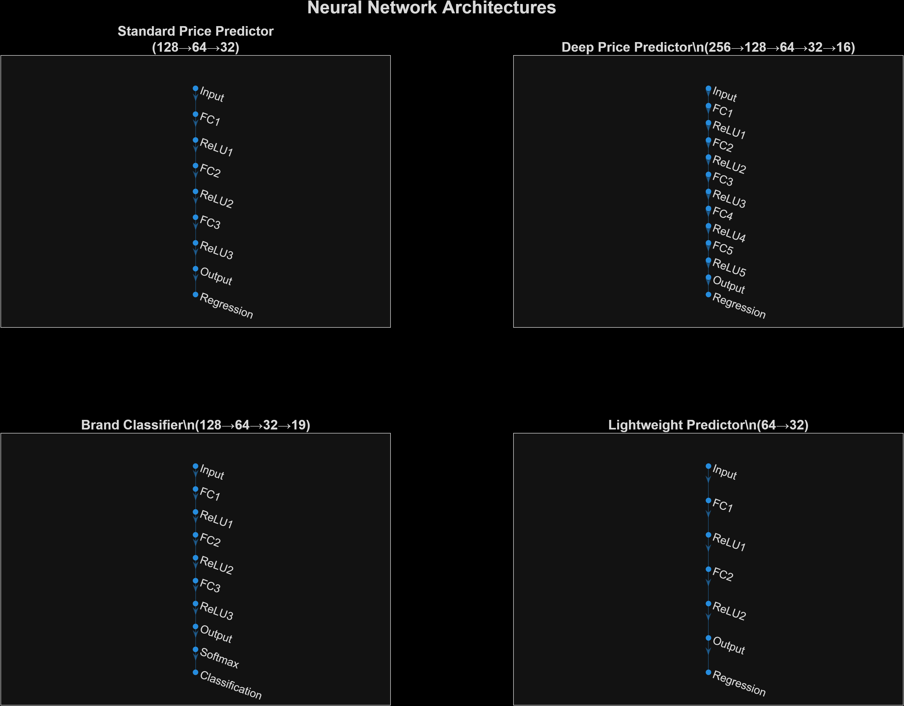
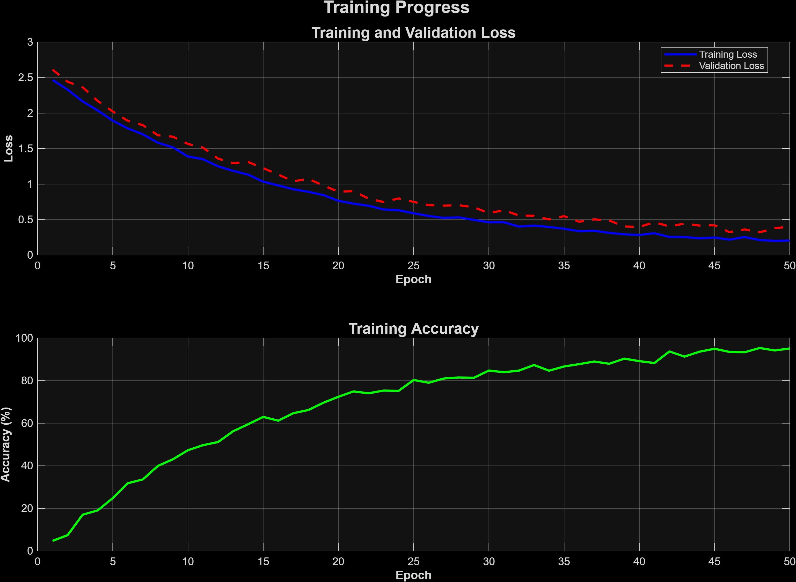
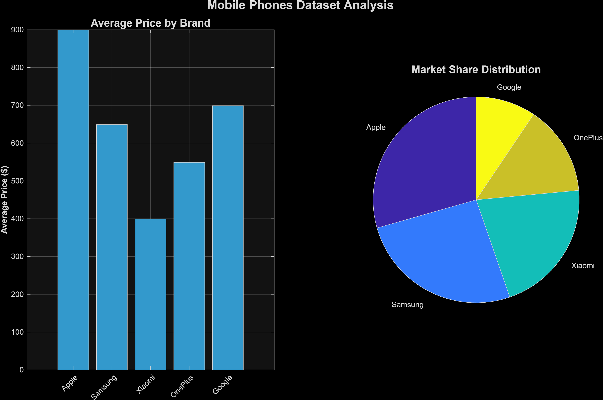
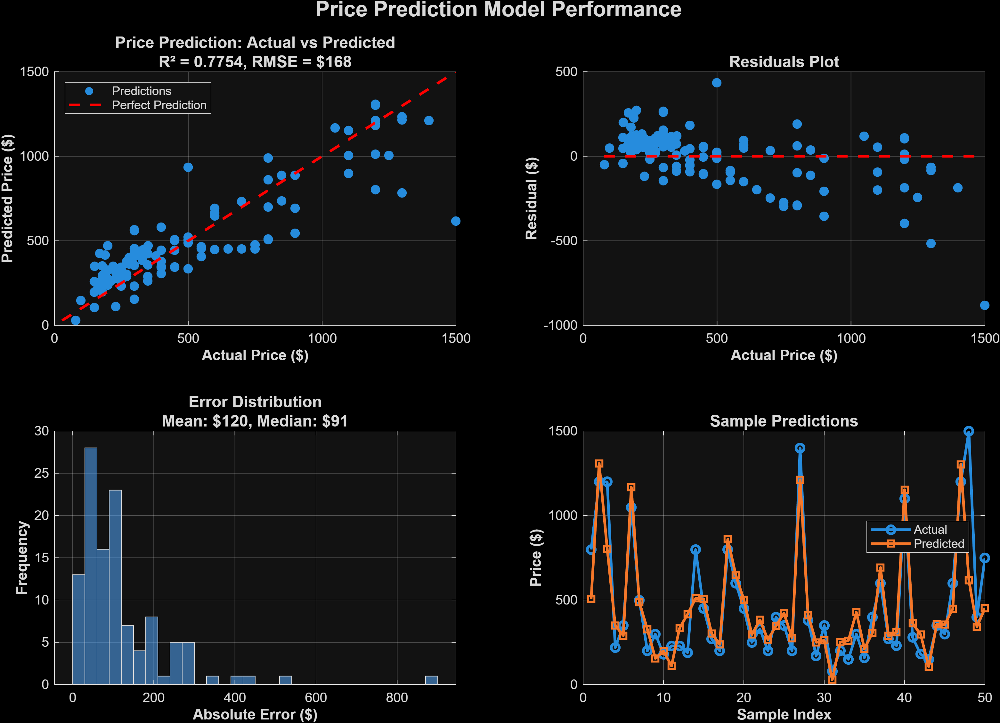

# MATLAB Deep Learning & Mobile Phones Dataset Project

<div align="center">


A comprehensive MATLAB and Nuxt.js project for deep learning experiments, mobile phone dataset analysis, and MATLAB capabilities checking. This project combines MATLAB's Deep Learning Toolbox with a modern web interface for exploring neural networks, analyzing mobile phone datasets, and checking MATLAB installation capabilities.

[Features](#-features) • [Installation](#️-installation) • [Quick Start](#-quick-start) • [Documentation](#-documentation) • [Screenshots](#-visual-showcase)

</div>

---

## 📸 Visual Showcase

### Web Interface - MATLAB Capabilities Checker

<div align="center">


*Interactive web interface for checking MATLAB capabilities*

</div>

### MATLAB Capabilities Results

<div align="center">


*Comprehensive MATLAB capabilities report with toolboxes, GPU info, and system details*

</div>

### Deep Learning Network Visualizations

<div align="center">


*Neural network architecture visualization*


*Training progress and metrics*

</div>

### Mobile Phones Dataset Analysis

<div align="center">


*Mobile phones dataset analysis and insights*


*Price prediction model results*

</div>

> **Note:** Screenshots are placeholders. Add your actual screenshots to the `docs/images/` directory and they will automatically display here.

## 🚀 Features

<div align="center">

| Feature | Description | Status |
|---------|-------------|--------|
| 🌐 **Web Interface** | Interactive Nuxt.js app for MATLAB capabilities | ✅ Ready |
| 🧠 **Deep Learning** | CNN, LSTM, Autoencoder, ResNet examples | ✅ Ready |
| 📱 **Dataset Analysis** | Complete mobile phones dataset pipeline | ✅ Ready |
| 🎯 **Price Prediction** | Trained neural network model | ✅ Ready |
| 🔍 **Capabilities Check** | Multiple methods (Web, CLI, Python, MATLAB) | ✅ Ready |
| 🚀 **GPU Support** | Automatic GPU detection and acceleration | ✅ Ready |

</div>

### MATLAB Capabilities Checker (Nuxt 4 Web App)
- **Interactive Web Interface** - Beautiful UI for checking MATLAB capabilities
- **Multiple Check Methods** - Web interface, Node.js CLI, Python CLI, or direct MATLAB script
- **Comprehensive Reporting** - Version info, installed toolboxes, system info, GPU detection, license info
- **Real-time Results** - Instant feedback on your MATLAB installation

### Deep Learning Examples
- **Multiple Network Architectures** - CNN, LSTM, Autoencoder, ResNet-style networks
- **Working Examples** - All examples tested and ready to use
- **GPU Acceleration** - Automatic GPU detection and configuration
- **Visualization Tools** - Network architecture visualization
- **Training Examples** - Complete training pipelines with best practices

### Mobile Phones Dataset Analysis
- **Complete Dataset Pipeline** - Preprocessing, analysis, and training scripts
- **Price Prediction Model** - Trained neural network for mobile phone price prediction
- **Multiple Network Types** - Tabular regression, CNN classification, hybrid networks
- **Insights Extraction** - 5 categories of insights (Price Drivers, Market Trends, Competitive Analysis, Recommendations, Anomaly Detection)
- **Real-world Examples** - Practical scripts for mobile phone data analysis

### Cross-Platform Tools
- **MATLAB Scripts** - Native MATLAB scripts for all operations
- **Python Support** - Python scripts for .mat file viewing and analysis
- **Node.js Support** - JavaScript/TypeScript scripts for capabilities checking
- **Environment Setup** - Automated setup scripts for all platforms

## 📋 Prerequisites

### Required
- **MATLAB R2026a** (or compatible version)
  - Deep Learning Toolbox (required)
  - Statistics and Machine Learning Toolbox (recommended)
- **Node.js** (v18+ recommended) - For Nuxt web app
- **Python 3.8+** - For Python scripts and .mat file viewing

### Optional
- **NVIDIA GPU** - For accelerated deep learning training (CUDA-compatible)
- **Kaggle CLI** - For downloading datasets (if using Kaggle datasets)

## 🛠️ Installation

### 1. Clone the Repository
```bash
git clone <repository-url>
cd MatLab
```

### 2. Install Node.js Dependencies
```bash
npm install
```

### 3. Set Up Python Environment

**Windows:**
```batch
setup_python_env.bat
```

**Linux/Mac:**
```bash
chmod +x setup_python_env.sh
./setup_python_env.sh
```

### 4. Set Up MATLAB Environment
```matlab
run('setup_matlab_env.m')
```

### 5. Configure MATLAB Path
Edit `matlab.config.json` with your MATLAB installation path:
```json
{
  "matlabPath": "C:\\Program Files\\MATLAB\\R2026a\\bin"
}
```

## 🎯 Quick Start

### Start the Web App
```bash
npm run dev
```
Visit `http://localhost:3000` to use the MATLAB capabilities checker.

<div align="center">


*Quick start demonstration*

</div>

### Check MATLAB Capabilities
**Method 1: Web Interface (Recommended)**
1. Start dev server: `npm run dev`
2. Open `http://localhost:3000`
3. Click "Check MATLAB Capabilities"

**Method 2: Node.js CLI**
```bash
npm run check
```

**Method 3: Python CLI**
```bash
python check-capabilities.py
```

**Method 4: MATLAB Script**
```matlab
run('check_matlab_capabilities.m')
```

### Run Deep Learning Examples
```matlab
% Run all examples
run('run_all_examples.m')

% Or run individual examples
run('examples/cnn_example.m')
run('examples/lstm_example.m')
run('examples/autoencoder_example.m')
```

### Analyze Mobile Phones Dataset
```matlab
% Complete pipeline
cd mobiles-dataset-docs
run('run_all_steps.m')

% Or individual steps
run('preprocess_dataset.m')
run('extract_all_insights.m')
run('train_price_prediction_model.m')
```

## 📁 Project Structure

```
.
├── app.vue                      # Root Nuxt app component
├── pages/                       # Nuxt pages
│   └── index.vue               # Main capabilities checker page
├── server/                      # Server-side API
│   └── api/
│       └── matlab/
│           └── capabilities.get.ts  # MATLAB capabilities API endpoint
├── examples/                    # Deep learning examples
│   ├── cnn_example.m           # CNN for image classification
│   ├── lstm_example.m          # LSTM for sequences
│   ├── autoencoder_example.m   # Autoencoder example
│   ├── resnet_style_example.m  # ResNet-style network
│   ├── simple_training_example.m  # Training setup
│   ├── visualize_networks.m   # Network visualization
│   └── mobiles_*.m             # Mobile dataset examples
├── mobiles-dataset-docs/        # Mobile phones dataset documentation
│   ├── preprocess_dataset.m    # Data preprocessing
│   ├── extract_all_insights.m  # Insights extraction
│   ├── train_price_prediction_model.m  # Model training
│   ├── predict_price.m         # Price prediction function
│   ├── trained_models/         # Saved models
│   └── preprocessed/           # Preprocessed data
├── check_matlab_capabilities.m  # MATLAB capabilities script
├── check-capabilities.js       # Node.js CLI script
├── check-capabilities.py       # Python CLI script
├── setup_matlab_env.m          # MATLAB environment setup
├── setup_python_env.bat        # Windows Python setup
├── setup_python_env.sh         # Linux/Mac Python setup
├── view_mat_file.m             # MATLAB .mat file viewer
├── view_mat_file.py            # Python .mat file viewer
├── view_mat_file.js            # Node.js .mat file viewer
├── matlab.config.json          # MATLAB configuration
├── nuxt.config.ts              # Nuxt configuration
├── package.json                 # Node.js dependencies
├── requirements.txt             # Python dependencies
└── README.md                    # This file
```

## 📚 Documentation

### Main Documentation
- **[ENVIRONMENT_SETUP.md](ENVIRONMENT_SETUP.md)** - Detailed environment setup guide
- **[EXAMPLES_SUMMARY.md](EXAMPLES_SUMMARY.md)** - Deep learning examples summary
- **[deep-learning-networks-guide.md](deep-learning-networks-guide.md)** - Comprehensive deep learning guide
- **[time_series_forecasting_guide.md](time_series_forecasting_guide.md)** - Time series forecasting guide
- **[SECURITY.md](SECURITY.md)** - Security notes and vulnerability information

### Mobile Phones Dataset Documentation
- **[mobiles-dataset-docs/README.md](mobiles-dataset-docs/README.md)** - Mobile dataset overview
- **[MOBILES_DATASET_GUIDE.md](MOBILES_DATASET_GUIDE.md)** - Network architecture guide for mobile dataset
- **[INSIGHTS_EXTRACTION_GUIDE.md](INSIGHTS_EXTRACTION_GUIDE.md)** - Insights extraction guide
- **[mobiles-dataset-docs/QUICK_START.md](mobiles-dataset-docs/QUICK_START.md)** - Quick start for mobile dataset

### Additional Resources
- **[README_MAT_FILES.md](README_MAT_FILES.md)** - Guide for working with .mat files
- **[docs/SCREENSHOT_GUIDE.md](docs/SCREENSHOT_GUIDE.md)** - Complete guide for adding screenshots and visualizations
- **[docs/images/README.md](docs/images/README.md)** - Screenshot requirements and tips

## 💻 Usage Examples

### View .mat Files

**Python:**
```bash
# Activate virtual environment first
source venv/bin/activate  # Linux/Mac
# or
venv\Scripts\activate.bat  # Windows

# View .mat file
python view_mat_file.py mobiles-dataset-docs/trained_models/price_predictor.mat

# Save to file
python view_mat_file.py file.mat -o output.json
```

**MATLAB:**
```matlab
view_mat_file('mobiles-dataset-docs/trained_models/price_predictor.mat')
view_mat_file('file.mat', 'output.txt')  % Save to text file
```

### Make Price Predictions
```matlab
% Load trained model
load('mobiles-dataset-docs/trained_models/price_predictor.mat')

% Predict price
price = predict_price(6, 4000, 6.1, 174, 2024, 'Apple');
fprintf('Predicted price: $%.0f\n', price);
```

### Build Custom Networks
```matlab
% See examples in examples/ directory
run('examples/cnn_example.m')
run('examples/lstm_example.m')
```

## 🔧 Configuration

### MATLAB Configuration
Edit `matlab.config.json`:
```json
{
  "matlabPath": "C:\\Program Files\\MATLAB\\R2026a\\bin"
}
```

### Nuxt Configuration
Edit `nuxt.config.ts` for app settings, modules, and build configuration.

### Python Environment
Edit `requirements.txt` to add/remove Python packages.

## 🧪 Testing

### Test MATLAB Capabilities
```bash
npm run check
```

### Test Python Environment
```bash
python -c "import scipy, numpy, pandas; print('All packages installed!')"
```

### Test MATLAB Environment
```matlab
% Check if paths are added
which('view_mat_file')

% Check GPU
gpuDevice

% Load environment config
load('matlab_env_config.mat');
disp(envConfig);
```

## 🚀 Build for Production

### Build Nuxt App
```bash
npm run build
npm run preview
```

### Generate Static Site
```bash
npm run generate
```

## 📊 Dataset Information

### Mobile Phones Dataset
- **Source:** Kaggle - [abdulmalik1518/mobiles-dataset-2025](https://www.kaggle.com/datasets/abdulmalik1518/mobiles-dataset-2025)
- **Format:** CSV
- **Columns:** Company Name, Model Name, Mobile Weight, RAM, Front Camera, Back Camera, Processor, Battery Capacity, Screen Size, Regional Prices (Pakistan, India, China, USA, Dubai), Launched Year

### Download Dataset
```bash
# Using Kaggle CLI
kaggle datasets download abdulmalik1518/mobiles-dataset-2025
unzip mobiles-dataset-2025.zip

# Or use the download script
cd mobiles-dataset-docs
bash download_mobiles_dataset.sh
```

## 🎓 Supported Network Types

<div align="center">

| Network Type | Use Case | Example |
|--------------|----------|---------|
| 🖼️ **CNN** | Image classification | `examples/cnn_example.m` |
| 🔄 **LSTM/RNN** | Sequence data, time series | `examples/lstm_example.m` |
| 🔀 **Autoencoder** | Dimensionality reduction | `examples/autoencoder_example.m` |
| 🔗 **ResNet** | Deep networks with skip connections | `examples/resnet_style_example.m` |
| 📊 **FCN** | Tabular data, regression | `examples/mobiles_tabular_regression.m` |
| 🎯 **Hybrid** | Multiple data types | `examples/mobiles_hybrid_network.m` |
| 🚀 **Transfer Learning** | Pretrained models | See deep learning guide |

</div>

## 🔍 What Gets Checked

The MATLAB capabilities checker reports:
1. **Version Information** - MATLAB version, release, Java version
2. **Installed Toolboxes** - All installed MATLAB toolboxes and versions
3. **System Information** - Computer architecture and system details
4. **Key Capabilities** - Image Processing, Statistics & ML, Signal Processing, Control Systems, Optimization, Parallel Computing, Deep Learning, Symbolic Math
5. **Memory Information** - Available and total system memory
6. **GPU Information** - GPU availability and specifications
7. **License Information** - Active MATLAB licenses

## 🛡️ Security

See [SECURITY.md](SECURITY.md) for security notes, including information about dependency vulnerabilities and their impact on this project.

## 📝 Scripts Reference

### NPM Scripts
- `npm run dev` - Start development server
- `npm run build` - Build for production
- `npm run generate` - Generate static site
- `npm run preview` - Preview production build
- `npm run check` - Check MATLAB capabilities (Node.js)

### MATLAB Scripts
- `setup_matlab_env.m` - Set up MATLAB environment
- `check_matlab_capabilities.m` - Check MATLAB capabilities
- `run_all_examples.m` - Run all deep learning examples
- `view_mat_file.m` - View .mat file contents

### Python Scripts
- `setup_python_env.bat/sh` - Set up Python environment
- `check-capabilities.py` - Check MATLAB capabilities (Python)
- `view_mat_file.py` - View .mat file contents (Python)

## 🤝 Contributing

Contributions are welcome! Please feel free to submit a Pull Request.

## 📄 License

MIT License - see package.json for details.

## 🔗 Related Resources

- [MATLAB Deep Learning Toolbox Documentation](https://www.mathworks.com/help/deeplearning/)
- [Nuxt.js Documentation](https://nuxt.com/docs)
- [Kaggle Mobile Phones Dataset](https://www.kaggle.com/datasets/abdulmalik1518/mobiles-dataset-2025)

## 📧 Support

For issues, questions, or contributions, please open an issue on GitHub.

## 📸 Adding Screenshots

To add screenshots to this README:

### Quick Start

1. **Generate MATLAB visualizations automatically:**
   ```matlab
   run('generate_visualizations.m')
   ```
   Or use the comprehensive generator:
   ```matlab
   run('docs/generate_all_visualizations.m')
   ```
   This creates visualizations using your actual trained models:
   - Model performance comparisons
   - Price prediction results (using your trained model)
   - Dataset analysis charts (from your actual data)
   - Network architecture diagrams
   - Training progress plots

2. **Capture web interface screenshots manually:**
   - Start dev server: `npm run dev`
   - Open `http://localhost:3000`
   - Take screenshots of the interface and capabilities results
   - Save to `docs/images/` directory

3. **Screenshots will automatically display** in the Visual Showcase section above.

### Detailed Guide

See **[docs/SCREENSHOT_GUIDE.md](docs/SCREENSHOT_GUIDE.md)** for complete instructions on:
- Capturing all required screenshots
- Using the automated visualization generator
- Image optimization tips
- Troubleshooting

### Recommended Screenshot Sizes
- **Web interface**: 1280x720 or 1920x1080
- **MATLAB outputs**: 1280x720
- **Network visualizations**: 1024x768 or larger
- **Charts/graphs**: 1200x800

---

<div align="center">

**Made with ❤️ using MATLAB, Nuxt.js, and Python**

[⬆ Back to Top](#matlab-deep-learning--mobile-phones-dataset-project)

</div>

**Note:** This project requires MATLAB R2026a (or compatible) with the Deep Learning Toolbox installed. The web interface is built with Nuxt 4 and provides an interactive way to check MATLAB capabilities and explore deep learning examples.
