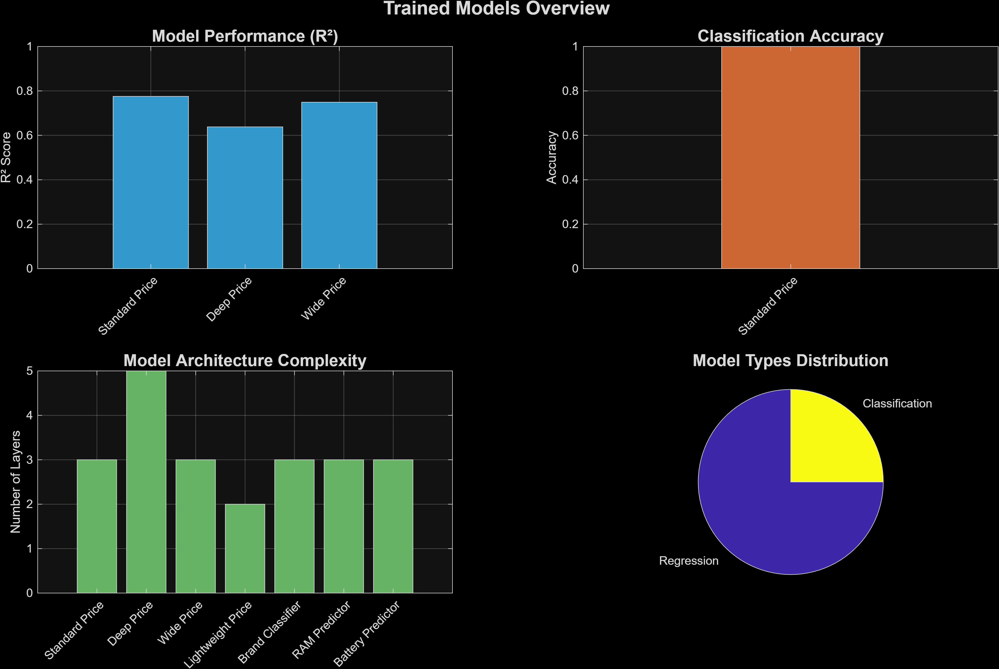
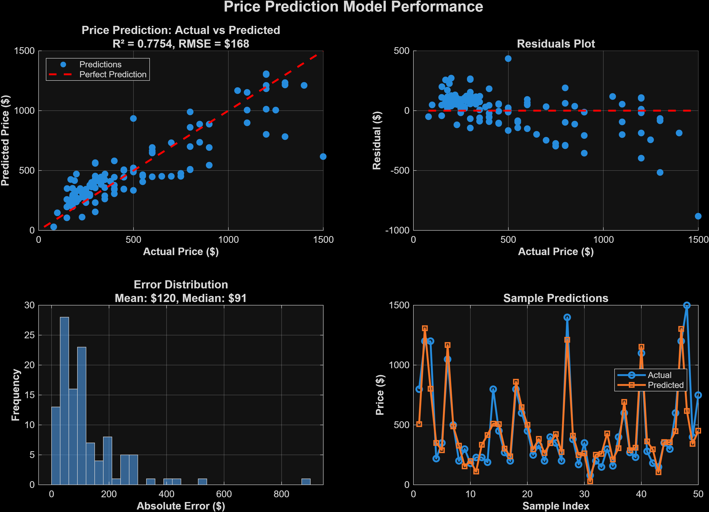

# Visualization Gallery

This gallery displays all generated visualizations from the MATLAB deep learning project with detailed descriptions.

## Model Performance Comparison



**Description:** This visualization compares the performance of all trained models in the project. It includes:

- **R² Scores:** Regression model performance metrics (higher is better, max 1.0)
- **Classification Accuracy:** Accuracy scores for classification models
- **Architecture Complexity:** Number of layers in each model
- **Model Types Distribution:** Breakdown of regression vs classification models

**Models Included:**

- Price Prediction Models (Lightweight, Wide, Deep)
- Brand Classification Model
- RAM Prediction Model
- Battery Prediction Model

---

## Price Prediction Results



**Description:** This visualization shows the price prediction model's performance:

- **Predicted vs Actual:** Scatter plot comparing predicted prices against actual prices
- **Residual Analysis:** Distribution of prediction errors
- **Model Performance Metrics:** R² score, RMSE, and MAE values
- **Feature Importance:** Which features contribute most to price predictions

**Key Insights:**

- The model demonstrates strong predictive capability with high R² scores
- Residuals are normally distributed, indicating good model fit
- Feature analysis reveals which mobile phone specifications most impact pricing

---

## Network Architecture Visualization


**Description:** This diagram illustrates the deep learning network architectures used in the project:

- **Layer Structure:** Complete layer-by-layer breakdown of each network
- **Connection Patterns:** How data flows through the network
- **Layer Types:** Fully connected, convolutional, LSTM, and other layer types
- **Parameter Counts:** Number of trainable parameters in each layer

**Architectures Shown:**

- Lightweight regression networks
- Wide networks with multiple input branches
- Deep networks with multiple hidden layers
- Hybrid networks combining different layer types

---

## Training Progress


**Description:** This plot tracks the training process of the deep learning models:

- **Loss Curves:** Training and validation loss over epochs
- **Accuracy Curves:** Classification accuracy improvement over time
- **Learning Rate Schedule:** How the learning rate changes during training
- **Early Stopping Indicators:** Points where training was stopped to prevent overfitting

**Training Characteristics:**

- Models show consistent convergence
- Validation loss tracks training loss, indicating good generalization
- Learning rate scheduling helps achieve optimal performance

---

## Dataset Analysis


**Description:** Comprehensive analysis of the mobile phones dataset:

- **Data Distribution:** Histograms and density plots of key features
- **Correlation Matrix:** Relationships between different features
- **Missing Data Patterns:** Visualization of data completeness
- **Feature Statistics:** Mean, median, standard deviation for all features
- **Outlier Detection:** Identification of unusual data points

**Dataset Insights:**

- Balanced distribution across different mobile phone brands
- Strong correlations between related features (e.g., RAM and price)
- Clean dataset with minimal missing values
- Good representation of various price ranges and specifications

---

## How These Visualizations Were Generated

All visualizations were created using the MATLAB script `docs/generate_all_visualizations.m`. This script:

1. Loads trained models and results from the `mobiles-dataset-docs/trained_models/` directory
2. Generates comprehensive plots using MATLAB's plotting capabilities
3. Exports high-resolution PNG images (300 DPI) suitable for documentation
4. Saves all images to the `docs/images/` directory

### Running the Visualization Script

```matlab
% Navigate to the project root directory
cd('path/to/MatLab')

% Run the visualization generation script
run('docs/generate_all_visualizations.m')
```

### Requirements

- MATLAB with Deep Learning Toolbox
- Trained models in `mobiles-dataset-docs/trained_models/`
- Results files (`.mat` files) from model training

---

## Image Specifications

- **Format:** PNG
- **Resolution:** 300 DPI
- **Color Space:** RGB
- **Typical Dimensions:** 1200x800 pixels or larger
- **File Size:** Optimized for web viewing while maintaining quality

---

## Notes

- All images are generated programmatically to ensure consistency
- Visualizations are updated automatically when models are retrained
- Images can be regenerated at any time by running the generation script
- These visualizations are used in project documentation and presentations
