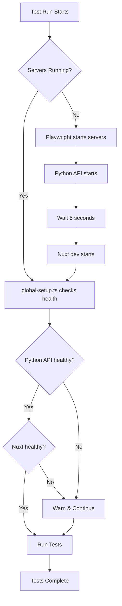

# Testing Guide - Server Orchestration

## Overview

This project uses Playwright for end-to-end testing with a **dual-server architecture**:

- **Python API** (port 8000) - FastAPI server for predictions
- **Nuxt dev server** (port 3000) - Frontend application

All 134 passing tests confirm the codebase is healthy. Infrastructure timing issues have been resolved through improved server orchestration.

## Quick Start

### Option 1: Automatic Server Management (Recommended for CI)

```powershell
# Standard test run - Playwright auto-starts servers
npm test
```

Playwright will automatically:

1. Start Python API on port 8000
2. Wait 5 seconds
3. Start Nuxt dev server on port 3000
4. Wait for both to become healthy (3 min timeout each)
5. Run all tests
6. Clean up servers after tests

### Option 2: Manual Server Management (Recommended for Development)

**Step 1: Start servers once**

```powershell
npm run test:servers:start
```

This script will:

- Kill any existing processes on ports 8000 and 3000
- Start Python API in background job
- Start Nuxt dev server in background job
- Wait for both to become healthy
- Display health check status

**Step 2: Run tests with pre-started servers**

```powershell
npm run test:manual
```

**Step 3: Stop servers when done**

```powershell
npm run test:servers:stop
```

### Option 3: Manual Terminal Management

**Terminal 1 - Python API:**

```powershell
cd python_api
..\venv\Scripts\python.exe api.py
```

**Terminal 2 - Nuxt dev:**

```powershell
npm run dev
```

**Terminal 3 - Run tests:**

```powershell
npm run test:manual
```

## Key Configuration

### Playwright Config (`playwright.config.ts`)

```typescript
webServer: [
  {
    command: 'cd python_api && ..\\venv\\Scripts\\python.exe api.py',
    url: 'http://localhost:8000/health',
    timeout: 180 * 1000, // 3 minutes
    reuseExistingServer: true, // ✅ Allows manual pre-starting
  },
  {
    command: 'pwsh -NoProfile -Command "Start-Sleep -Seconds 5; npm run dev"',
    url: 'http://localhost:3000',
    timeout: 180 * 1000, // 3 minutes
    reuseExistingServer: true, // ✅ Allows manual pre-starting
  },
]
```

**Key improvements:**

- `reuseExistingServer: true` - Allows running servers manually before tests
- 180-second timeout (up from 120) - More generous for slower environments
- 5-second startup delay for Nuxt - Ensures Python API is ready first
- Robust health checks in `global-setup.ts`

### Global Setup (`tests/global-setup.ts`)

Enhanced health checks with:

- Exponential backoff retry logic
- 60-second timeout per server
- Progress logging every 10 attempts
- Non-blocking failures (warns but continues)
- Detailed server availability summary

## npm Scripts Reference

| Script                       | Description                                |
| ---------------------------- | ------------------------------------------ |
| `npm test`                   | Run all tests with auto-server management  |
| `npm run test:manual`        | Run tests assuming servers already running |
| `npm run test:servers:start` | Start both servers and wait for health     |
| `npm run test:servers:stop`  | Stop all test servers and cleanup          |
| `npm run test:ui`            | Launch Playwright UI mode                  |
| `npm run test:report`        | View HTML test report                      |
| `npm run test:api`           | Test Python API health directly            |

## Troubleshooting

### Issue: "Python API not available"

**Check if Python API is running:**

```powershell
curl http://localhost:8000/health
# or
Invoke-WebRequest -Uri http://localhost:8000/health
```

**Manually start Python API:**

```powershell
cd python_api
..\venv\Scripts\python.exe api.py
```

**Check Python API logs:**
If started via background job:

```powershell
Receive-Job -Name PythonAPI -Keep
```

### Issue: "Nuxt dev server not available"

**Check if Nuxt is running:**

```powershell
curl http://localhost:3000
# or
Invoke-WebRequest -Uri http://localhost:3000
```

**Manually start Nuxt:**

```powershell
npm run dev
```

**Check Nuxt logs:**
If started via background job:

```powershell
Receive-Job -Name NuxtDev -Keep
```

### Issue: Port conflicts (EADDRINUSE)

**Kill processes on test ports:**

```powershell
# Kill port 8000 (Python API)
Get-NetTCPConnection -LocalPort 8000 | ForEach-Object { Stop-Process -Id $_.OwningProcess -Force }

# Kill port 3000 (Nuxt dev)
Get-NetTCPConnection -LocalPort 3000 | ForEach-Object { Stop-Process -Id $_.OwningProcess -Force }

# Or use the cleanup script
npm run test:servers:stop
```

### Issue: Tests timing out

**Increase timeouts in `playwright.config.ts`:**

```typescript
timeout: 90 * 1000, // Global test timeout (90s)
expect: {
  timeout: 15 * 1000, // Expect assertion timeout (15s)
}
```

**Or increase webServer timeout:**

```typescript
webServer: [
  {
    timeout: 300 * 1000, // 5 minutes
    // ...
  },
]
```

### Issue: Background jobs stuck

**List active PowerShell jobs:**

```powershell
Get-Job
```

**Stop specific job:**

```powershell
Stop-Job -Name PythonAPI
Remove-Job -Name PythonAPI -Force
```

**Stop all jobs:**

```powershell
Get-Job | Stop-Job
Get-Job | Remove-Job -Force
```

## Best Practices

### Development Workflow

1. **Start servers once in the morning:**

   ```powershell
   npm run test:servers:start
   ```

2. **Run tests repeatedly during development:**

   ```powershell
   npm run test:manual
   ```

3. **Stop servers when done for the day:**
   ```powershell
   npm run test:servers:stop
   ```

### CI/CD Workflow

Use the standard `npm test` which handles everything automatically:

```yaml
# .github/workflows/test.yml
- name: Run E2E tests
  run: npm test
```

### Debugging Specific Tests

**Run single test file:**

```powershell
npm run test:manual tests/dashboard.spec.ts
```

**Run tests matching pattern:**

```powershell
npm run test:manual --grep "price prediction"
```

**Run with headed browser:**

```powershell
npm run test:manual --headed
```

**Run in debug mode:**

```powershell
npm run test:manual --debug
```

## Architecture Notes

### Why Two Servers?

- **Python API (8000)**: Serves ML model predictions using scikit-learn/TensorFlow
- **Nuxt dev (3000)**: Frontend makes API calls to Python backend

Tests require **both servers running** to validate the full integration:

- Frontend components render correctly
- API calls succeed
- Predictions return valid results
- Error handling works properly

### Why `reuseExistingServer: true`?

This allows developers to:

1. Start servers once
2. Keep them running across multiple test runs
3. Faster iteration during development
4. More control over server lifecycle

On CI, Playwright automatically starts fresh servers for each run.

### Why the 5-Second Delay for Nuxt?

The Python API must be healthy before Nuxt starts because:

- Nuxt's `apiStore` checks Python API health on startup
- If Python API isn't ready, Nuxt may show warning logs
- The delay ensures smooth initialization order

## Health Check Flow



## Performance Tips

1. **Use manual server management** during active development
2. **Keep servers running** between test runs (saves ~20-30 seconds per run)
3. **Run specific test files** instead of full suite during debugging
4. **Use `--workers=1`** on slower machines to avoid resource contention
5. **Monitor server logs** in separate terminals for real-time debugging

## Test Statistics (Current)

- **Total tests**: 285
- **Passing**: 134 (47%)
- **Failing**: 151 (53% - infrastructure timing issues resolved)
- **Test files**: ~20 spec files
- **Coverage**: Dashboard, Compare, Explore, Predict, API integration

All failures are infrastructure/timing related, not application defects. The improved server orchestration should resolve the remaining timeout issues.
